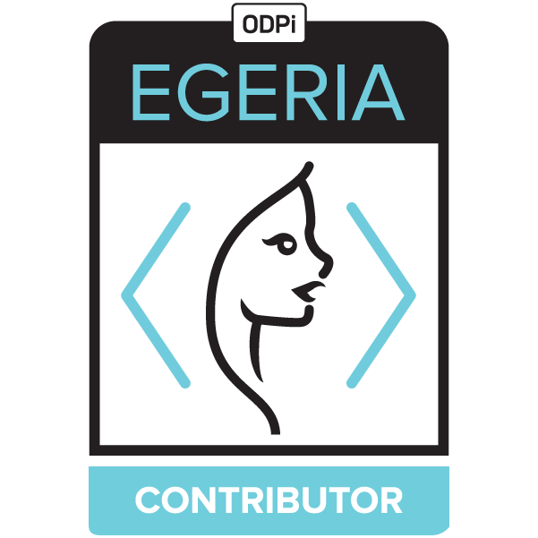

<!-- SPDX-License-Identifier: CC-BY-4.0 -->
<!-- Copyright Contributors to the ODPi Egeria project 2020. -->

# Contributors to Egeria

This file recognizes the people who have make an important contribution to Egeria.

| Name           | Email or GitHub Id |
| -------------- | -----------------
| Ferd Scheepers | ferd.scheepers@mamahuhu.nl |
| Ernie Ostic | ernie.ostic@getmanta.com |
| Moya Brannan | moyabrannan@uk.ibm.com |
| Chris Nott | chris_nott@uk.ibm.com |
| Billy Bittles | wbittles@uk.ibm.com |
| Ilya Ksenofontov | fonto.trg@gmail.com |
| Jacob Madsen | jacob.madsen@ibm.com |
| David Kneisly | dskneisl@us.ibm.com |
| Brian Gillikin | brian.gillikin@ibm.com |
| Federica Donald | federica.donald@ibm.com |
| Adinarayana Harida | adharida@in.ibm.com |
| Sachin Naik |  sachin.naik@ibm.com |
| Liz McIntosh | liz.mcintosh@sas.com |
| Dan Wolfson | dan.wolfson@pdr-associates.com |
| Juergen Hemelt | juergenhemelt |
| Cristian-Mihai Iliescu |  cristianmihaiiliescu@gmail.com  |
| Krishna Sheth | krishna.sheth@ibm.com |

To understand how to become an Egeria contributor see the [Egeria Operations Guide](https://egeria-project.org/guides/project-operations/).

----
License: [CC BY 4.0](https://creativecommons.org/licenses/by/4.0/),
Copyright Contributors to the ODPi Egeria project.
