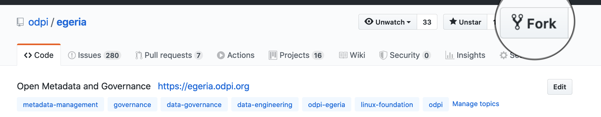

<!-- SPDX-License-Identifier: CC-BY-4.0 -->
<!-- Copyright Contributors to the ODPi Egeria project. -->

# Egeria Community Guide

This project welcomes contributors from any organization or background, provided they are
willing to follow the simple processes outlined below, as well as adhere to the 
[Code of Conduct](https://github.com/odpi/specs/wiki/ODPi-Code-of-Conduct).

## Joining the community

The community collaborates primarily through `Zoom` calls, `GitHub` and the instance messaging tool, `Slack`.
There is also a mailing list.

### Zoom calls

There are two regular online meetings using Zoom each week, both on a Tuesday. All are welcome.

* **Developers call** - one hour - 
  Discussion on code development - not minuted -
  
  10 am (UK); 11 am (Amsterdam/CET); 12pm (Bucharest)
  
  Zoom Conference [https://zoom.us/j/523629111](https://zoom.us/j/523629111)
  
* **Community call** - one hour - 
  Demos, meet-ups and other activities going on in the Egeria community
  
  2pm (UK); 3pm (Amsterdam/CET); 4pm (Bucharest)
  
  Zoom Conference [https://zoom.us/j/523629111](https://zoom.us/j/523629111)
 
  Meeting Agenda and Minutes are here [https://github.com/odpi/data-governance/wiki](https://github.com/odpi/data-governance/wiki)
  

### Connecting to Slack

Egeria uses the [ODPi's Slack community](http://slack.odpi.org/) to provide an ongoing dialogue between members.
This creates a recorded discussion of design decisions and discussions that complement the project meetings.

Follow the link above and register with the ODPi slack service using your email address.
Once signed in you can see all of the active slack channels.
The main slack channel for the Egeria project is called `#egeria-project`:

[https://odpi.slack.com/messages/CAZDMLTFF](https://odpi.slack.com/messages/CAZDMLTFF]).

Additional channels are added from time to time as new workgroups and discussion topics are established.

### Egeria's mailing list

Follow the link to sign up to the [mailing list](https://lists.odpi.org/g/odpi-project-egeria).

## Steps to contribute content to the project

The Egeria project used [GitHub](https://github.com/odpi)
to maintain its content.  It has the following repositories:

* [egeria](https://github.com/odpi/egeria) - contains the core Egeria function along with samples, tutorials and documentation.
* [egeria-connector-hadoop-ecosystem](https://github.com/odpi/egeria-connector-hadoop-ecosystem) - contains connectors to integrate
technologies from the hadoop ecosystem into the open metadata ecosystem.
* [egeria-connector-ibm-information-server](https://github.com/odpi/egeria-connector-ibm-information-server) - contains connectors to integrate IBM Information Server into the open metadata ecosystem.
* [data-governance](https://github.com/odpi/data-governance) - contains Egeria's Guidance on Governance (GoG) as well as
large media files such as presentations and movies.
* [egeria-dev-projects](https://github.com/odpi/egeria-dev-projects) - contains fun projects for developers to help them learn about the Egeria technology.
* [egeria-palisade](https://github.com/odpi/egeria-palisade) - contains content from the collaboration between
the Egeria project and the [Palisade](https://github.com/gchq/palisade) project.

All of these repositories are publicly visible.  However, if you want to contribute new content then you need
to create a GitHub account.  This can be done from the top of the GitHub home page.

## Steps to contribute content to the project

Once you have a GitHub id you can proceed.

1. Review the [developer guidelines](developer-resources/Developer-Guidelines.md).
1. Link to the repository that you want to contribute to and open an issue to cover the proposed change.
1. Fork/clone the repository and prepare your contribution in a new git branch (see [Using git to prepare a contribution](#using-git-to-prepare-a-contribution)).
1. As you commit your changes, make sure they are signed (see [Why the DCO?](#why-the-dco)).
1. Create a [git pull request](#creating-a-pull-request) from [GitHub](https://github.com/odpi/egeria) to initiate the request to include your changes into the master branch of Egeria.
1. Wait for a maintainer to review and approve the pull request.

### Important additional setup for Windows users

If using git on windows, it is **essential** to configure long pathname support, since 
otherwise the git clone, and other git operations on Egeria **will** fail.

Ensure you have a current version of git installed (for example 2.17 or above), and in an Elevated command prompt run:

```posh
git config --system core.longpaths true
```

For more detail see [this article](https://github.com/msysgit/msysgit/wiki/Git-cannot-create-a-file-or-directory-with-a-long-path).

This is not required on MacOS or Linux.

## Using git to prepare a contribution

The core Egeria content is located in git at [https://github.com/odpi/egeria](https://github.com/odpi/egeria).

All contributors must use the [GitHub's fork and pull model](https://help.github.com/articles/about-collaborative-development-models/),
which will support contributions from anyone without requiring direct write access to the Egeria repository.

### Create an issue on GitHub

All contributions should begin by creating an new a
[GitHub Issue](https://github.com/odpi/egeria/issues).
Describe the change that you propose to make and why.
This will help the Egeria maintainers understand your contribution.
It is also possible to ask questions and validate your design
through the issue.  

### Creating a fork

If you are intending to contribute code rather than browse, the easiest way to prepare 
a contribution is to start off by
creating a [fork](https://guides.github.com/activities/forking/) of the Egeria repository.

This can be done by navigating the the [Egeria URL](https://github.com/odpi/egeria) above,
and logging into the github UI with a 
registered account. You will then see a 'Fork' button at the top right, and should click this to 
create your own fork to work with Egeria. 



This only needs to be done once.

### Creating a local copy of the code

To create a copy of the code on your machine enter the following in a new directory. Replace `USER` with your GitHub userId.

```bash
$ git clone https://github.com/USER/egeria.git
$ cd egeria
```

The git clone command creates a new directory called `egeria` containing the Egeria content.

It is recommended not to make any changes to master, other than pulling from upstream (the master Egeria project)
but just to use for reference and as a basis for branching.

You should also set the upstream repository to connect your fork to the main Egeria repository:

```bash
$ git remote add upstream https://github.com/odpi/egeria.git
```

### Creating a branch for your work

Always create a branch for each distinct set of changes. This keeps the commit history pushed
to Egeria clean, and makes reviews of the code much easier. Since GitHub manages pull
requests on a branch basis it is also a way to be able to easily rework, by updating a
change later before it has been incorporated back into the main Egeria code.

First update your copy of master and push to your github fork

```bash
$ git checkout master
$ git pull upstream master
$ git push
```

Once you have the latest code on your machine, create a branch for your changes. The
commands below set up a branch called "example-branch" based off of master, and also push
it back to your personal fork:

```bash
$ git checkout -b example-branch master
$ git push origin example-branch

```

When you create your own branch, use a name that describes that the branch is for as you will
use it for all changes you are collecting together to push as one group to Egeria.
This name will be publicly visible too once you start pushing your changes
to Egeria so keep it clean :).

You can also see that 'origin' will point to your GitHub fork, whilst 'upstream' points to the Egeria master branch:

```bash
$ git remote -v

origin https://github.com/USER/egeria (fetch)
origin https://github.com/USER/egeria (push)
upstream https://github.com/odpi/egeria.git (fetch)
upstream https://github.com/odpi/egeria.git (push)

```

### Working with the Egeria code in your personal environment

Now you can make your changes to the content.  

Once this is complete,
issue the `git status` command to verify all of your changes are
included.  This will list any files that have been changed, but not included
for git control.  Use `git add` to add all of the files you want included.

For example:

```bash
$ git status

On branch example-branch
Untracked files:
  (use "git add <file>..." to include in what will be committed)

	new-file.java

$ git add new-file.java
$ git status

On branch example-branch
Changes to be committed:
  (use "git reset HEAD <file>..." to unstage)

	new file:   new-file.java
```

You can now commit changes to your local repository, making sure 
to use the `-s` option to sign your changes (see [Why the DCO?](#why-the-dco))
and the `-m` option to provide a useful commit message. In the message you can
make use of [special strings](https://blog.github.com/2011-10-12-introducing-issue-mentions/) to
directly link to GitHub
issues. By doing this others following the issue will see the commits to your fork
easily so can track the work going on even before you submit to the **egeria** repository.

It is also essential to push the changes from your local machine up to GitHub ready for the next step.

```bash
$ git commit -s -m 'Best code change ever as per Issue #1433'
$ git push 
```

If you think there is ongoing work in a similar area to that of your changes, you may find it useful to pull
the latest master code prior to completing your changes ie

```bash
$ git pull upstream master
```

and then making any necessary changes to merge conflicts, and commit/push as above.

### Creating a pull request

The easiest way to create a pull request is by navigating to your local fork of the Egeria repository eg. `https://github.com/USER/egeria`,
selecting your working branch,
and clicking on 'pull request'.
Add an explanation and links to any GitHub Issues that are relevant
to your change,
and then submit the pull request.

GitHub automatically validates that you have signed all of your commits and
that any code builds.

The Egeria maintainers will then review and if all is well, it will be merged
into the master branch and you have officially made a successful contribution to
the project.  Congratulations :).

Further changes can be done using the same branch, and will be added to the same pull request
automatically until the pull request is merged into master.

### Creating a Linux Foundation account

The Linux Foundation provide build and distribution facilities.
You need an account to access some of the reports from the build.

This is the link to create a [Linux Foundation account](https://identity.linuxfoundation.org). 
Note the username and password you selected.


### Cleaning up

Once all work has been completed, including changes appearing in master, only then can your temporary branch be deleted:

```bash
$ git branch -d example-branch
$ git push -d origin example-branch
```

You may need to use `-D` if not all changes are merged, but check carefully!

### Additional git tips

If you are working locally, and realise you have accidentally been making changes on master instead of another branch:

```bash
$ git stash
$ git checkout -b correct-branch
$ git stash pop
```

Messed up your master branch?

```bash
$ git checkout master
$ git fetch upstream
$ git reset --hard HEAD
$ git push
```

Correct your last commit

```bash
$ git commit --amend -s -m "New commit message"
```

View recent changes

```bash
$ git log
```

View recent changes in a prettier way:

```bash
$ git log --pretty=format:"%h %ad | %s%d [%an]" --graph --date=short
```

Take a fix you have pushed to a different branch (perhaps a top-level pom change, or something else you need) and apply it to your current branch:

```bash
$ git cherry-pick <commit-id>
```

# Why the DCO?

We have tried to make it as easy as possible to make contributions. 
This applies to how we handle the legal aspects of contribution.

We simply ask that when submitting a patch for review,
the developer must include a sign-off statement in the commit message.
This is the same approach that the
[Linux® Kernel community](http://elinux.org/Developer_Certificate_Of_Origin)
uses to manage code contributions.

Here is an example Signed-off-by line, which indicates that the submitter accepts the DCO:

```
Signed-off-by: John Doe <john.doe@hisdomain.com>
```

You can include this automatically when you commit a change
to your local git repository using

```bash
$ git commit -s
```

By signing your work, you are confirming that the origin of the content
makes it suitable to add to this project.  See
[Developer Certificate of Origin (DCO)](https://developercertificate.org/).


----
License: [CC BY 4.0](https://creativecommons.org/licenses/by/4.0/),
Copyright Contributors to the ODPi Egeria project.
