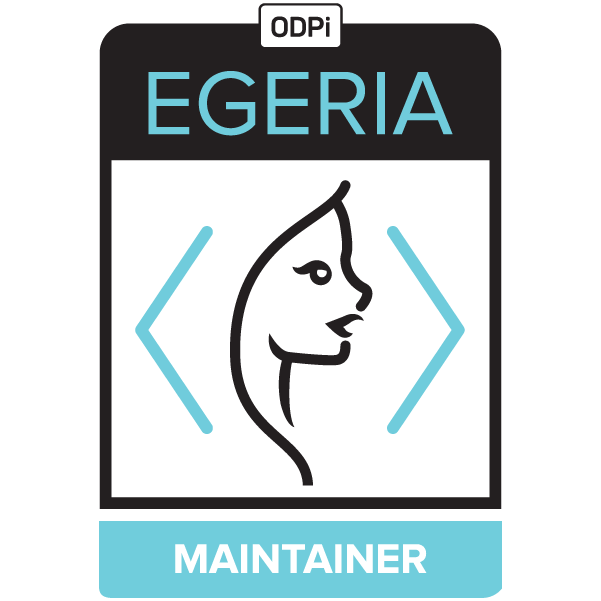
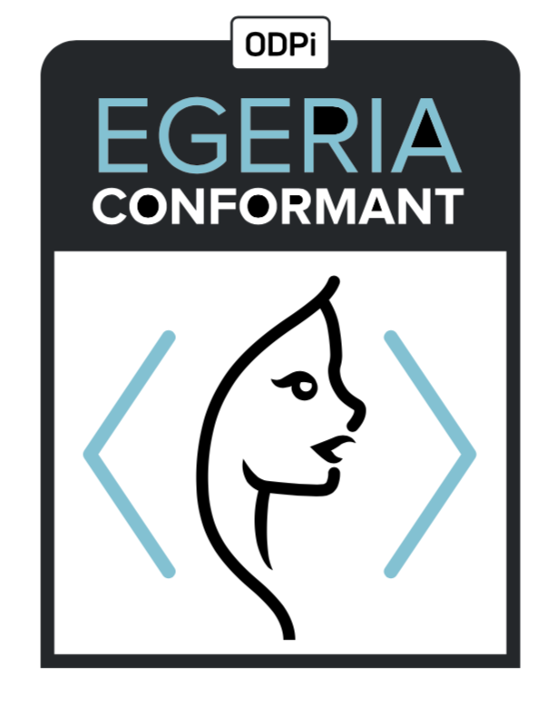

<!-- SPDX-License-Identifier: CC-BY-4.0 -->
<!-- Copyright Contributors to the ODPi Egeria project. -->

# Egeria Governance

The Egeria project's governance processes are described in
the [Egeria Operations Guide](./Egeria-Operations.md).
This includes the requirements to earn either of Egeria's two
[Acclaim badges](developer-resources/badges).

 

The Egeria Conformance program is supported by the
[Open Metadata Conformance Suite](open-metadata-conformance-suite).

The operation of the Egeria project is overseen by the
[ODPi's technical steering committee (TSC)](https://github.com/odpi/tsc).

If you are interested in joining the Egeria community,
see the [community guide](./Community-Guide.md) to find out more.

----
License: [CC BY 4.0](https://creativecommons.org/licenses/by/4.0/),
Copyright Contributors to the ODPi Egeria project.
