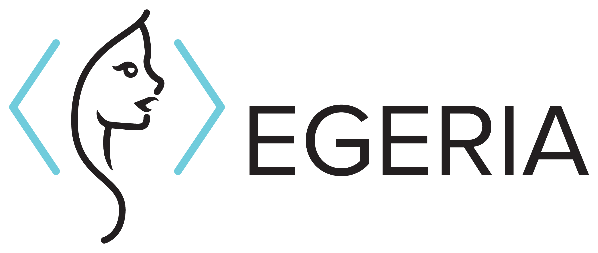

<!-- SPDX-License-Identifier: CC-BY-4.0 -->
<!-- Copyright Contributors to the Egeria project. -->

<!--  -->
<!--  -->

# Egeria - Open Metadata and Governance
  
Egeria provides the Apache 2.0 licensed [open metadata and governance](open-metadata-publication/website/README.md)
type system, frameworks, APIs, event payloads and interchange protocols to enable tools,
engines and platforms to exchange metadata in order to get the best
value from data whilst ensuring it is properly governed.

## Digging deeper

See the [Home Page](index.md) for more information about the project and [ODPi Egeria Site Organization Page](Content-Organization.md)
for details on how the content of the project is organized.  In addition,
the [release notes](release-notes) show the function that has been
delivered in each release and our future plans.

## Egeria governance

This project aims to operate in a transparent, accessible way for the benefit
of the Egeria community.
All participation in this project is open and not
bound to any corporate affiliation.

To understand how to join and contribute see the 
[Community Guide](./Community-Guide.md).

All participants are bound the ODPi's [Code of Conduct](https://github.com/odpi/specs/wiki/ODPi-Code-of-Conduct).
The governance of the project is described in more detail in the
[Egeria Operations Guide](./Egeria-Operations.md).

## Call schedule

The Egeria team run three types of calls and all are welcome

* **Developers call** - one hour - 
  Discussion on code development - not minuted -
  
  10 am (UK); 11 am (Amsterdam/CET); 12pm (Bucharest)
  
  Zoom Conference [https://zoom.us/j/523629111](https://zoom.us/j/523629111)
  
* **Community call** - one hour - 
  Demos, meet-ups and other activities going on in the Egeria community
  
  8am (EST); 1pm (UK/GMT); 2pm (Amsterdam/CET); 3pm (Bucharest)
  
  Zoom Conference [https://zoom.us/j/523629111](https://zoom.us/j/523629111)
 
  Meeting Agenda and Minutes are here [https://wiki.lfaidata.foundation/display/EG/Community+Meetings](https://wiki.lfaidata.foundation/display/EG/Community+Meetings)
  
* **Technical Steering Committee (TSC)** - one hour -
  Discussion on the management of the community
  
  Activities and call schedule
  are here [https://wiki.lfaidata.foundation/display/EG/Egeria+Technical+Steering+Committee+%28TSC%29+Home](https://wiki.lfaidata.foundation/display/EG/Egeria+Technical+Steering+Committee+%28TSC%29+Home)

## Monthly maintainers face-to-face meetings

**Covid-19 update on Face-to-Face meetings**

The Egeria face-to-face meetings are currently suspended
to protect the health and welfare of the Egeria community.
The TSC will arrange virtual maintainers meetings as needed.  Details are on the
TSC Wiki detailed above.

Minutes of past maintainers meetings can be found on the
[Egeria GitHub wiki](https://github.com/odpi/egeria/wiki).

## Monthly community webinars

The Egeria community are running a monthly webinar series
covering a variety of topics.

Follow [this link](https://github.com/odpi/data-governance/tree/master/webinars)
for details of the webinar schedule, and links to download
the presentations from past webinars.

## Acknowledgements

We are grateful to [YourKit, LLC](https://www.yourkit.com) for supporting open source projects with its full-feature
Java Profiler.

----
License: [CC BY 4.0](https://creativecommons.org/licenses/by/4.0/),
Copyright Contributors to the Egeria project.
