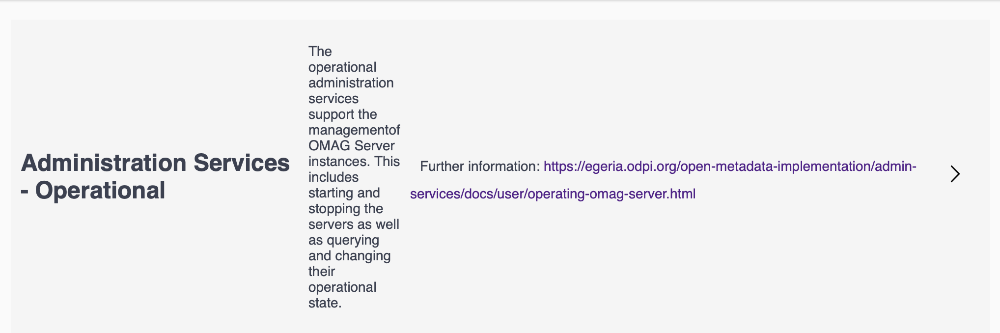

<!-- SPDX-License-Identifier: CC-BY-4.0 -->
<!-- Copyright Contributors to the ODPi Egeria project 2020. -->

# Swagger

Swagger automatically generates a website that documents the REST APIs supported by the
[OMAG Server Platform](https://egeria-project.org/omag-server-platform).
It is based on the [Open API Specification (V3)](http://spec.openapis.org/oas/v3.0.3).

The website is found at  `<serverURLroot>/swagger-ui.html`.
For example if the platform is running at `https://localhost:9443`, the URL for Swagger is
`https://localhost:9443/swagger-ui.html`

The top of the page gives a general description of the OMAG Server platform plus
a link to more documentation.

The content for this header is located in the [OMAGServerPlatform.java](https://github.com/odpi/egeria/blob/master/open-metadata-implementation/server-chassis/server-chassis-spring/src/main/java/org/odpi/openmetadata/serverchassis/springboot/OMAGServerPlatform.java)
file that provides the `main()` method for the OMAG Server Platform.

It is using Open API annotations that look like this:

Beneath the header is a list of the platform's REST APIs.  This is the definition for the
Operational Services that are part of the Administration Services:

The REST API operations
are grouped into services by the following `@Tag` annotation that appears in each spring resource bean
that is part of the service.  If the name of the `@Tag` matches then the operations in the
resource beans are all part of the same service.

These are the annotations from [OperationalServicesResource.java](https://github.com/odpi/egeria/blob/master/open-metadata-implementation/admin-services/admin-services-spring/src/main/java/org/odpi/openmetadata/adminservices/spring/OperationalServicesResource.java).

Further information can be provided for each operation.  This is one of the
Operational Services operations.

This is added to the spring resource bean
using the `@Operation` annotation.

----
* Return to [Developer Tools](.)

* Link to [Egeria's Community Guide](https://egeria-project.org/guides/community/)
* Link to the [Egeria Dojo Education](https://egeria-project.org/education/egeria-dojo/)

----
License: [CC BY 4.0](https://creativecommons.org/licenses/by/4.0/),
Copyright Contributors to the ODPi Egeria project.
