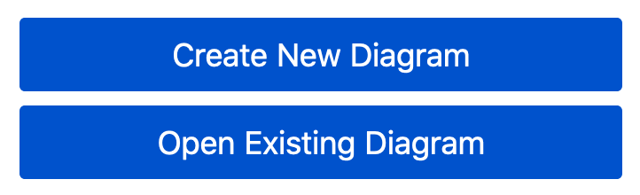
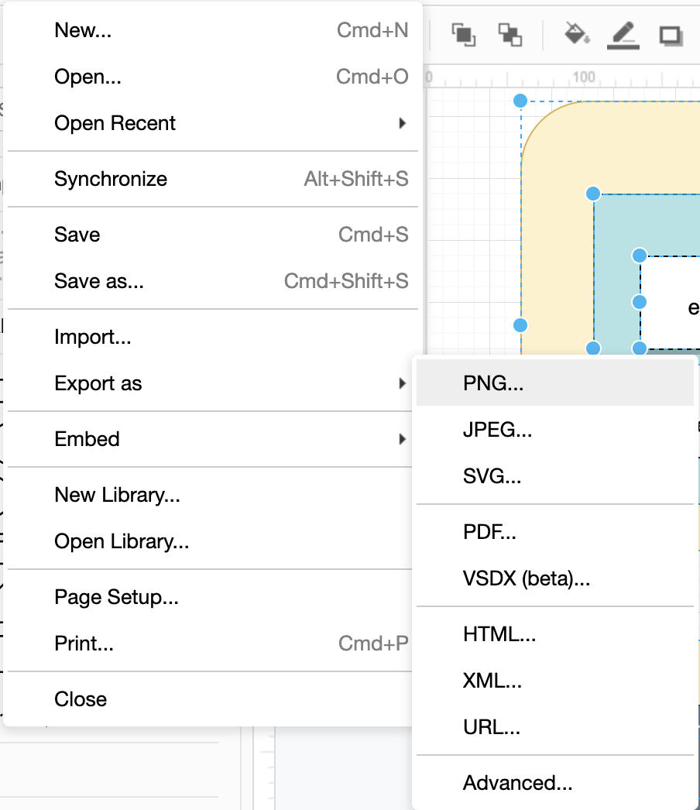
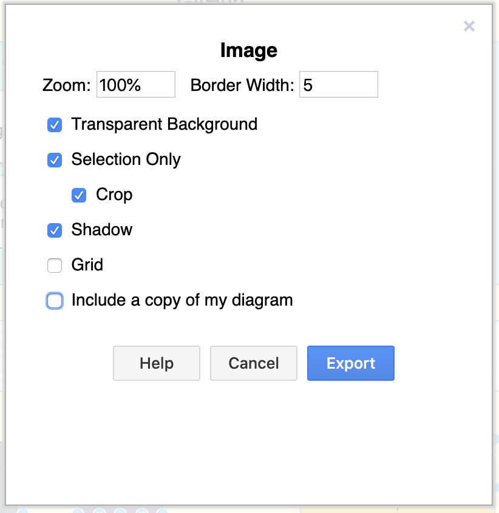

<!-- SPDX-License-Identifier: CC-BY-4.0 -->
<!-- Copyright Contributors to the ODPi Egeria project 2020. -->

# draw.io

You may have noticed many files in the Egeria repository with a file type of `drawio`.
These are diagram files created by the **draw.io** tool.
This is a free tool that produces very smart diagrams for including in our website
or for presentations.

The tool can be run from the browser, or as a desktop tool.  We recommend the desktop
tool if you are doing editing of the diagrams because it supports autosave.

To run or download draw.io, go to this URL

```html
https://app.diagrams.net/
```
It will offer the chance to download the desktop.


Whenever you start draw.io, it offers the choice to either open a new diagram or an existing file.
On the desktop, `New...` means new window and you can use it to have multiple files open at once.

.

The draw.io tool is easy to use.  We typically put each diagram on a new tab.  Giving the
tab the same name as the image file makes it easier for others to locate it and makes the
process to generate the image easier.

## Creating an image file

The draw.io files are written in XML which means it is easy to manage them in git.
To create an image file to include in a presentation or webpage, select the part of the diagram to
export.
Then select the `File->Export->PNG...` menu option.



Then fill in the export properties as follows:



Select `Shadow` for most diagram unless you have explicitly added shadowing to the diagram, or
there is freestanding text as the shadow makes this text hard to read.

----
* Return to [Developer Tools](.)


* Link to [Egeria's Community Guide](https://egeria-project.org/guides/community/)
* Link to the [Egeria Dojo Education](https://egeria-project.org/education/egeria-dojo/)


----
License: [CC BY 4.0](https://creativecommons.org/licenses/by/4.0/),
Copyright Contributors to the ODPi Egeria project.