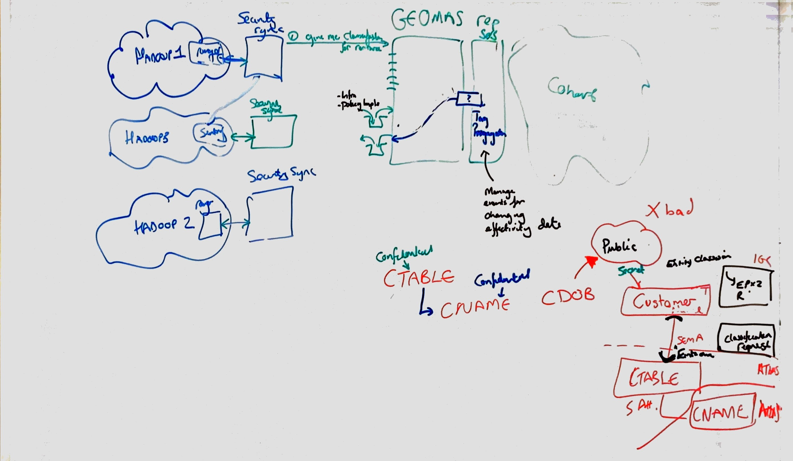
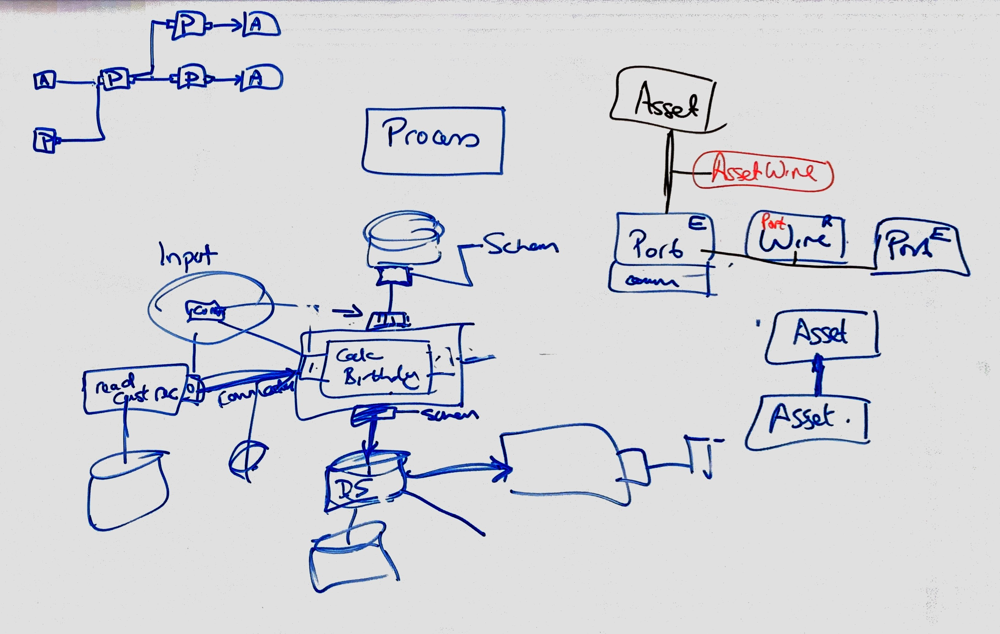
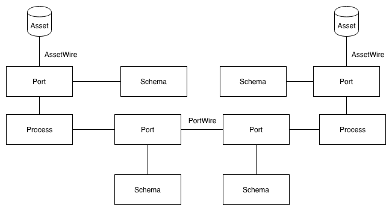
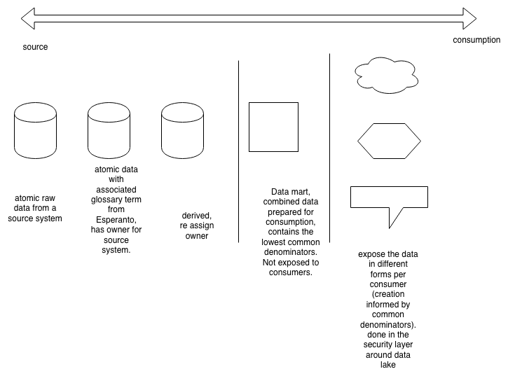
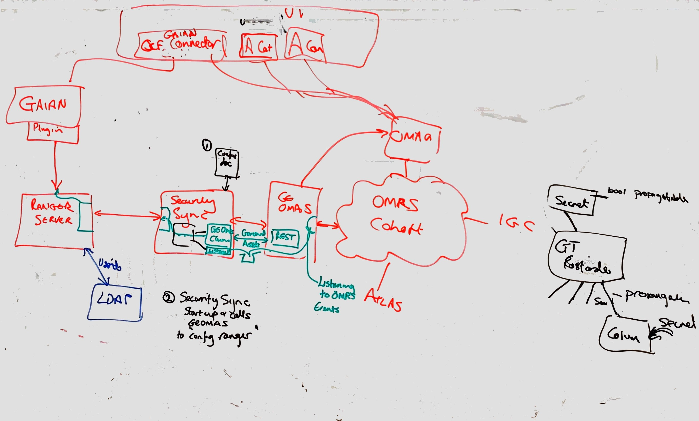

<!-- SPDX-License-Identifier: CC-BY-4.0 -->
<!-- Copyright Contributors to the ODPi Egeria project. -->
# ODPi/Egeria Working Group Meeting 

January 9th and 10th: Egeria Working Group meeting to discuss projects and architecture.

**NOTE: These are proposed diagrams and architecture and are not final or implemented.**

## Agenda: Day 1

1. Round of updates & open questions
    - Asset Lineage OMAS Jing & Guy (tentative)
    - Data Engine OMAS - Raluca
    - Asset Catalog -- Daniela
    - Information View OMAS -Ruxandra
    - Community Profile OMAS -Mandy
    - Dev process for building OMAS- Mandy
    - Atlas local Connector & Event Mapper - Graham
    - Graph visualization - Graham
    - Subject Area - David
    - UI -- Bogdan
    - Demo - Chris Replogle
    - Event mapper & Virtualizer - Yuefeng
    - POCs update -- Maryna
    - Data Platform OMAS - Maryna

2. Walk through the SonarQube report and update by component owners on the progress & what still needs to be fixed

3. THINK 2019 preparation update/next steps

## Agenda: Day 2 Wednesday 9 Jan 2019 -- Architecture focused

1. 9h -- 12:30h -Resolving the row level security
    - what attributes
        - where are they
        - how do we use them?
    - Zoning
        - is it Geo-Location
        - Department?

2. 13h -13:30h IGC Connector 11.5 update - Chris Grote

3. 13:30h -- 14:30h - Emily Jiang, She is the technical lead for the [Eclipse MicroProfile](https://microprofile.io/) -- call.

4. Egeria metadata store (persistence)

5. Production version of Egeria ... any components are missing?

# Day 1

2019-01-08 Tue ODPi/Egeria WG Meeting @IBM office

## Notes: [WebEx](https://ibm.webex.com/meet/jonesn)

### Governance Engine OMAS Showcasing (Maryna) 3pm

- TagToTagPropagation
- Classifications on the business objects, not on the spine attributes.
- hasA causes and implied classification.
- audit log the discrepancy between two classifications on spine attributes inherited then hide all of them.
- spine attribute only on 1 spine object.
- getEffectiveClassification on spineAttribute.
- validate on GE for glossary. ?? RuleEngine validations.

#### Whiteboard Discussion on Security Sync

### Asset Lineage (Jing & Guy)

- use case review
- 2 stores, event sourcing possibly to derive 1 graph from the other.

#### Whiteboard Discussion on Process, Ports, and Wires

#### Lineage with Ports and Wires

### Asset Catalog: (Daniela)

- search.

### Information View: (Ruxandra)

- Report referencing table.
- Report Elements with sections to show report columns, businessTerms,
    etc. with references to input data sources.
- Report referencing report: Report column reference from another
    report.
- import into Atlas view relationships between reports and report to
    schema elements with report element hierarchy.
- Demo update report and hierarchy re-created/updated/synced.
- Use of Glossary term should use Qualified Name, not Name as name is
    not unique within repository.

### Community Profile OMAS (Mandy

- area-1-collaboration.xml Review w/Mandy.
- Person: Roles, User Identity, contact details, etc.
- profile for team or group.
- PersonRole, ContributionRecord (KarmaPoints), etc.
- Team information
- IT Profiles
- Collections of assets or resources. supportingResources
- Projects
- Todo's off of person roles.
- Communities memberOf to PersonRole
- Notes
- Community Profile OMAS `REVIEW DOC` see below.
- MDM brings information in.

### Dev process for building OMAS (Mandy) See: [github](https://egeria.odpi.org/open-metadata-implementation/access-services/community-profile/docs/scenarios/)

- [A Rational Design Process: how and why to Fake it.](https://users.ece.utexas.edu/~perry/education/SE-Intro/fakeit.pdf)
- Review doc from mandy.
- [Design doc](https://egeria.odpi.org/open-metadata-implementation/access-services/docs/design/)
- How to write a local connector? ask Graham
- [Concepts](https://egeria.odpi.org/open-metadata-implementation/access-services/docs/concepts)

### Subject Area (David)

- Create/update/retrieve/delete/purge/get/restore term/category.
- relationships for term working with effective dates.
- todo: find a term.
- todo: more relationships.
- Phase 1: done and now usable.
- Question: nodes and lines, following relationships through terms.
- Classifications search find.
- derived graph using spine object attributes.

### Event Mapper & Virtualizer (Yuefeng)

- Sonar cube fixes updates.
- Repository connector vs Event Mapper.
- Chris G. questions on mapper/connector and IGC stuff.

### Data Engine OMAS (Raluca)

- inputs/outputs/ zoneMembership for om~process~.
- processInputData, processOutputData relationships.

### Demo (Chris Replogle)

- Native pattern use RepositoryHelper.
- See MyProfileHandler.java for example uses. Ask Mandy for more if
    needed.

### UI (Bogdan)

- Need to have Kafka, HBase, Solr, Atlas w/Patches, IGC, connector,
    all up and running for Demo.
- use external database to allow for fast load/restart of atlas.
- discussion of jar dependencies
- discussion of spring dependencies clean up.

# Day 2

2019-01-09 Wed ODPi/Egeria WG Meeting @ING

## Notes

### Security Context solution proposal discussion for Row-Level security w/Alex

- Required org entity set.

- Operational, finance, legal, risk, security, commercial
- roll up requirements for lowest level org entity indicator.
- must also deal with aggregated derived data from underling atomic data.
- consolidation, legal entity, accounting Business unit, department, cost center, profit center, capture id, cost center.
- Metadata attached to row for dimension sets.

### Role of Spine objects: (Maryna)

- [Tag Propagation](../../../../open-metadata-implementation/access-services/governance-engine/docs/TagPropogation/TagPropogation.md).
- typedBy in the role of spine objects.
- 9 Concepts/subjects (customer, sales, finance, operations, legal,... )
- Semantic modeling vs. structural modeling w/spine objects.

### [MicroProfile](https://microprofile.io/) meeting w/Emily Jiang

- presentation
- replaces spring boot/spring frameworks.
- demo [Open Liberty](http://openliberty.io)
- OpenAPI
- retry ability
- metrics
- health status
- counted to see how often called.

### Security Sync (Round 2)

- Picture on board for walk-through.
- Description of classification-propagation for criticality, confidentiality, and retention with follow-through for semantic assignment.
- Setting propagateable attribute on the above 3 classifications.

### Egeria Todos

1.  Atlas Needs:
    - save reference fix from Graham
    - soft hard delete issue with Atlas Graham
    - talk to HW to stabilize Atlas until think. Need a Git tag?
2.  Egeria:
    - Egeria UI - Bogdan.
    - need patch to set credentials on OMRS call when talking toAtlas. Bogdan to send to Nigel
    - change required so that find on Asset type returns the subtypes. LocalRepository updates for some stand-alone for classification with inheritance for findByClassification for entity. - Mandy
    - change Semantic Assignment to be propagative - to create the propagated classification. If the relationship is remote we need a new classified event
    - Security sync - issue call to the GE OMAS to get all the assets and classifications
    - change GE OMAS
    - testing of the IGC Connector and event mapper

### Wrap-Up and Discussions

- March: 5th, 6th, 7th as proposed working Group next meeting in Amsterdam.
- April: 9th, 10th, 11th proposed working group in Hursley.

----
License: [CC BY 4.0](https://creativecommons.org/licenses/by/4.0/),
Copyright Contributors to the ODPi Egeria project.