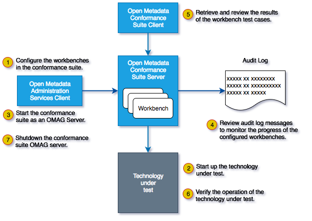

<!-- SPDX-License-Identifier: CC-BY-4.0 -->
<!-- Copyright Contributors to the ODPi Egeria project. -->

  
# Open Metadata Conformance Suite Documentation

The open metadata conformance suite provides a testing framework to help the developers
integrate a specific technology into the open metadata ecosystem.

Figure 1 shows the structure of the open metadata conformance suite.


> **Figure 1:** Overview of the open metadata conformance suite

The actual tests are run by an **open metadata conformance workbench** within the open metadata conformance suite server.
Each workbench focuses on testing a specific type of technology.
Today there are 2 workbenches:
* **[Platform Workbench](platform-workbench)** - which tests the REST API of an
[Open Metadata and Governance (OMAG) Server Platform](https://egeria-project.org/concepts/omag-server-platform)

* **[Repository Workbench](repository-workbench)** - which tests both the repository services 
[REST API](../../open-metadata-implementation/repository-services/docs/component-descriptions/omrs-rest-services.md)
and [event exchange](../../open-metadata-implementation/repository-services/docs/event-descriptions)
of an [open metadata repository](../../open-metadata-implementation/repository-services/docs/open-metadata-repository.md).

Future workbenches will cover other APIs and event types as well as
demonstrate the ability to handle various workloads and also
a performance benchmark test.

The workbenches are configured using the OMAG Server Platform Administration Services.
This defines which workbenches to run and how to connect to the technology to test.
This configuration defines an OMAG Server that will run the requested conformance suite tests.
The requested workbenches will begin to execute their tests as soon as the OMAG server is started.

For example, to run a metadata repository through the Repository Workbench, first configure a CTS
server in the OMAG Server Platform by [configuring its general properties like server type, event bus, cohort,
etc](https://egeria-project.org/guides/admin/servers).  Before starting the CTS server instance,
configure the repository workbench within it by POSTing to:

```
POST https://localhost:9443/open-metadata/admin-services/users/garygeeke/servers/cts/conformance-suite-workbenches/repository-workbench/repositories
```

with a repository workbench configuration like the following:

```json
{
	"class": "RepositoryConformanceWorkbenchConfig",
	"tutRepositoryServerName": "myserver",
	"maxSearchResults": 5
}
```

where the `tutRepositoryServerName` defines the name of the repository server you wish to test.  This repository server
to test (`myserver` in the example above) should be configured and started _after_ starting the CTS repository
workbench instance.  Once the CTS server instance is started it will wait for the technology under test
(the server named by the `tutRepositoryServerName` parameter) to be up and running before then starting its suite of
tests.

The `maxSearchResults` parameter controls the sizing of the tests: both the number of instances
the tests will attempt to create to carry out its tests and how extensive the search-based tests are.

An example collection of configuration calls for Postman can be found in
[Egeria-CTS-RepositoryWorkbench](../../open-metadata-resources/open-metadata-samples/postman-rest-samples/collection/Egeria-CTS-RepositoryWorkbench.postman_collection.json).

Egeria by default uses https:// requests with a self-signed certificate. Any PostMan users therefore will need to
go into settings->general and turn off 'SSL certificate verification' or requests will fail.
 
The OMAG Server also supports a REST API for querying the results of running
the conformance suite tests.  These commands include:

* Retrieve the results from a single named workbench.
* Retrieve the results from all workbenches and test cases (beware that the response can be 100's of MB in size, and may overflow your JVM heap).
* Retrieve the results from all failed test cases.
* Retrieve the IDs of all test cases.
* Retrieve the results from a specific test cases (for example, iterating through the above call's response).
* Retrieve the names of all profiles.
* Retrieve the details of a single profile's results (for example, iterating through the above call's response).

NOTE: The resulting reports can be large. Ensure the jvm running the CTS server has at least 1GB heap to avoid any Java Heap errors. 

The Open Metadata Conformance Suite also has a 
client called `OpenMetadataConformanceTestReport` that will retrieve
the conformance report and all details. It will store a summarized report in `openmetadata_cts_summary.json`,
and the full details of each profile and test case in `profile-details` and `test-cases`
sub-directories, respectively.
The client also outputs a summary of the test run.
The example below is for an unsuccessful run (where one of the Entity search tests has failed):

```
$ OpenMetadataConformanceTestReport cSuiteServer https://localhost:9444
=======================================
 Open Metadata Conformance Test Report
=======================================
Contacting conformance suite server: cts (https://localhost:9443)

Saving full profile details into 'profile-details' directory...
Summary of profile results:
... Metadata sharing: CONFORMANT_FULL_SUPPORT
... Reference copies: CONFORMANT_FULL_SUPPORT
... Metadata maintenance: CONFORMANT_FULL_SUPPORT
... Dynamic types: UNKNOWN_STATUS
... Graph queries: CONFORMANT_FULL_SUPPORT
... Historical search: CONFORMANT_FULL_SUPPORT
... Entity proxies: CONFORMANT_FULL_SUPPORT
... Soft-delete and restore: CONFORMANT_FULL_SUPPORT
... Undo an update: CONFORMANT_FULL_SUPPORT
... Reidentify instance: CONFORMANT_FULL_SUPPORT
... Retype instance: CONFORMANT_FULL_SUPPORT
... Rehome instance: CONFORMANT_FULL_SUPPORT
... Entity search: NOT_CONFORMANT
... Relationship search: CONFORMANT_FULL_SUPPORT
... Entity advanced search: CONFORMANT_FULL_SUPPORT
... Relationship advanced search: CONFORMANT_FULL_SUPPORT
Saving full test case details into 'test-case-details' directory (can take 1-2 minutes)...
Summary:
... number of tests: 4965
... number of tests passed: 4964
... number of tests failed: 1
... number of tests skipped: 0

Technology under test is not yet conformant

Process finished with exit code 1
```

This output is an example of a successful run:

```
$ OpenMetadataConformanceTestReport cSuiteServer https://localhost:9444
=======================================
 Open Metadata Conformance Test Report
=======================================
Contacting conformance suite server: cts (https://localhost:9443)

Saving full profile details into 'profile-details' directory...
Summary of profile results:
... Metadata sharing: CONFORMANT_FULL_SUPPORT
... Reference copies: CONFORMANT_FULL_SUPPORT
... Metadata maintenance: CONFORMANT_FULL_SUPPORT
... Dynamic types: UNKNOWN_STATUS
... Graph queries: CONFORMANT_FULL_SUPPORT
... Historical search: CONFORMANT_FULL_SUPPORT
... Entity proxies: CONFORMANT_FULL_SUPPORT
... Soft-delete and restore: CONFORMANT_FULL_SUPPORT
... Undo an update: CONFORMANT_FULL_SUPPORT
... Reidentify instance: CONFORMANT_FULL_SUPPORT
... Retype instance: CONFORMANT_FULL_SUPPORT
... Rehome instance: CONFORMANT_FULL_SUPPORT
... Entity search: CONFORMANT_FULL_SUPPORT
... Relationship search: CONFORMANT_FULL_SUPPORT
... Entity advanced search: CONFORMANT_FULL_SUPPORT
... Relationship advanced search: CONFORMANT_FULL_SUPPORT
Saving full test case details into 'test-case-details' directory (can take 1-2 minutes)...
Summary:
... number of tests: 4965
... number of tests passed: 4965
... number of tests failed: 0
... number of tests skipped: 0

Congratulations, technology under test is conformant

Process finished with exit code 0
```

----
License: [CC BY 4.0](https://creativecommons.org/licenses/by/4.0/),
Copyright Contributors to the ODPi Egeria project.
