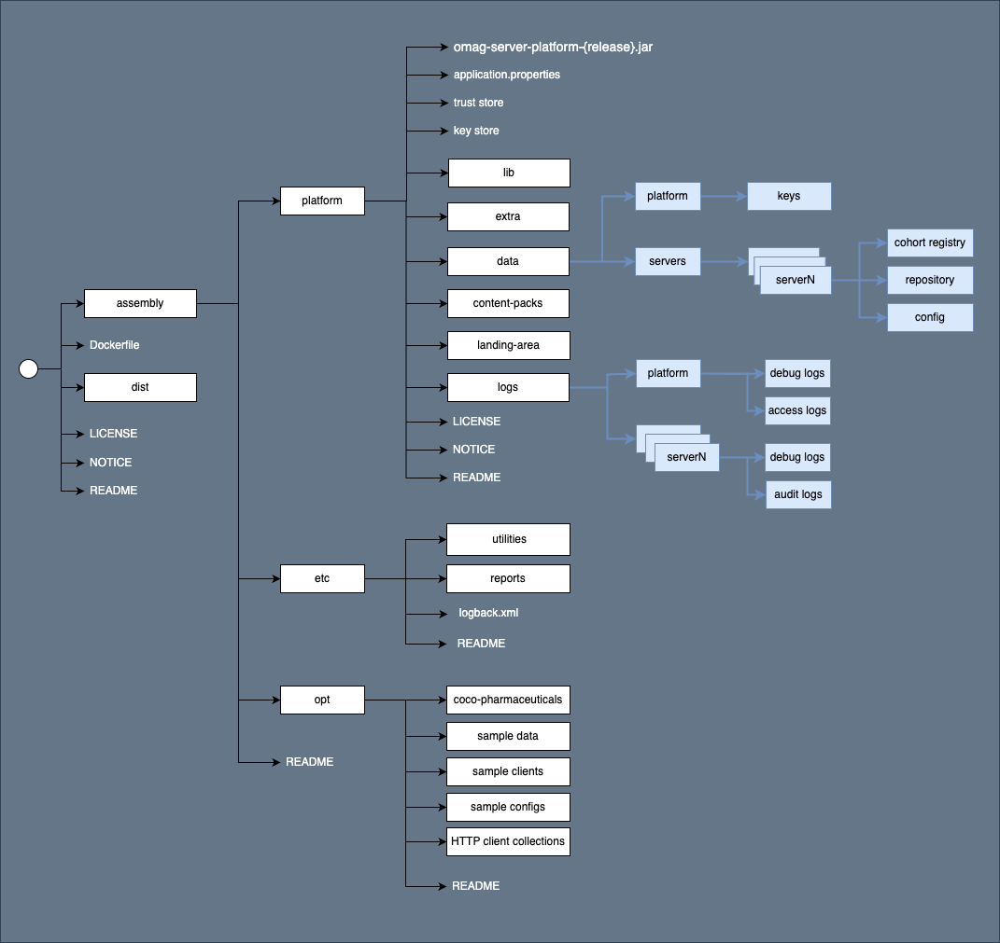

<!-- SPDX-License-Identifier: CC-BY-4.0 -->
<!-- Copyright Contributors to the ODPi Egeria project. -->

# OMAG Server Platform Distribution TAR file

The **OMAG Server Platform** module creates a distribution **tar** file that can be copied
and used to install Egeria's OMAG Server Platform.   For further information see
[Installing Egeria Tutorial](https://egeria-project.org/education/tutorials/installing-egeria-tutorial).

The diagram below shows the file layout for the OMAG Server Platform runtime environment. The directories shown in white are built by this assembly.  The ones shown in blue are created during the platform operation.

Each of the directories created by the assembly includes a `README.md` file that describes its content and how to use it.

In addition, the [Getting started with Egeria](https://getting-started-with-egeria.pdr-associates.com/introduction.html) blogs show how to make use of this assembly.

----
License: [CC BY 4.0](https://creativecommons.org/licenses/by/4.0/),
Copyright Contributors to the ODPi Egeria project.

 