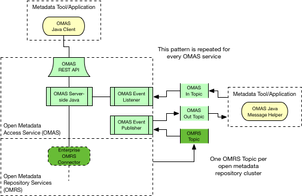

<!-- SPDX-License-Identifier: CC-BY-4.0 -->
<!-- Copyright Contributors to the ODPi Egeria project. -->
  
# Open Metadata Access Services (OMAS)

The Open Metadata Access Services (OMAS) provide domain-specific services
for data tools, engines and platforms to integrate with open metadata.

The access services are as follows:

* **[asset-catalog](asset-catalog)** - search for assets.

  The Asset Catalog OMAS provides search and query capabilities for tools and applications
to support an asset catalog function.
It supports search requests for assets with specific characteristics
and returns summaries of the matching assets, plus methods to allow drill-down
into the details of a specific asset to related metadata.

* **[asset-consumer](asset-consumer)** - create connectors to access assets.

  The Asset Consumer OMAS is designed for applications that are using OCF connectors to access data stores, APIs and
functions such as analytics.  The Asset Consumer OMAS provides a factory function
for the connectors, the ability to retrieve all of the metadata about the asset
and the ability to add feedback on the asset.

* **[asset-lineage](asset-lineage)** - Track and publish lineage data.

  The Asset Lineage OMAS listens to relevant lineage related events on the Enterprise topic level and publishes these on
  the Asset Lineage out topic, combined with relevant context information on the described entities. These events are 
  listened to by the Open Lineage Services governance server.  

* **[asset-owner](asset-owner)** - manage metadata and feedback for owned assets.

  The Asset Owner OMAS provides services for an asset owner to curate metadata about their
asset(s) and understand how these assets are being used and governed.

* **[community-profile](community-profile)** - manage personal profiles and communities.
  
  The Community OMAS supports the administration for a community and related user profiles.  These communities are
involved in reviewing and crowd-sourcing knowledge about the data assets and their use.

* **[data-engine](data-engine)** - exchange metadata with a data processing engine.
                                   
  The Data Engine OMAS provides APIs and events for a data movement/processing
engine to record the changes it is making the the data landscape. 
This information forms a key part of asset lineage.

* **[data-platform](data-platform)** - exchange metadata with a data platform.

  The Data Platform OMAS provides an integration point to enable data platforms to publish metadata to the metadata
repositories about the changing structures and content stored in the data platform.

* **[data-privacy](data-privacy)** - support a data privacy officer.

  The Data Privacy OMAS supports a privacy officer as they manage data privacy
in their organization.
This includes managing privacy impact assessments and reviews of software services
that use personal data as they move through their development, deployment and use.

* **[data-science](data-science)** - manage metadata for analytics.

  The Data Science OMAS provides access to metadata for data assets,
connections and projects, plus the ability to maintain metadata about data science notebooks
and models and log activity during the analytics development process.
It is designed for data science and analytics management tools.

* **[design-model](design-model)** - exchange design model content from tools and standards.

  The Design Model OMAS provides the ability to manage information from all types of design models.
These models may come from tools or be part of a packaged standard.
This content is useful for governance, system integration and software development.

* **[dev-ops](dev-ops)** - manage metadata for a devOps pipeline.
  
  The DevOps OMAS provides services for a DevOps pipeline to query and maintain metadata about systems, processes and
software components that are being deployed into the information landscape.

* **[digital-architecture](digital-architecture)** - support the design and architecture of the digital services
that support the business.

  The Digital Architecture OMAS provides the ability to define information standards, definitions, solution blueprints and
models for an organization.  It is designed for architecture tools.  It is able to support the
definition and management of a digital service through concept to deployment.

* **[discovery-engine](discovery-engine)** - manage metadata for metadata discovery services.

  The Discovery Engine OMAS provides an API for a discovery engine to access and store
metadata from an open
metadata repository (or open metadata repository cohort).

* **[governance-engine](governance-engine)** - manage metadata for an operational governance engine.

  The Governance Engine OMAS provides APIs and events that retrieve and
manage metadata for governance engines.  Governance engines ensure that 
the infrastructure supporting the data landscape is operating according
to the governance program. For example, the governance engine may be ensuring
that individuals and servers
only have access to the data they have been authorized to see.

* **[governance-program](governance-program)** - set up and manage a governance program.

  The Governance Program OMAS provides the ability to maintain a governance program in the open metadata repositories.
It is designed for governance and CDO tools.

* **[information-view](information-view)** - create virtual views over data.

  The Information View OMAS provides information on existing assets plus the ability to define views over these assets.
This OMAS is used by BI reporting tools and virtualization/federation tools to configure their engines.

* **[it-infrastructure](it-infrastructure)** - manage metadata about deployed infrastructure.

  The IT Infrastructure OMAS provides support for the design and planning of the information infrastructure
that supports the data assets.  This includes the development of system blueprints that link down to the metadata
about real infrastructure components.
This metadata helps in the linkage between information governance metadata
and IT infrastructure management (ITIL) metadata typically stored in a
Configuration Management Database (CMDB).

* **[project-management](project-management)** - manage definitions of projects for metadata
management and governance.

  The Project Management OMAS supports the metadata associated with projects and campaigns.
These projects and campaigns may be for governance projects, or generic data use projects.

* **[security-officer](security-officer)** - set up rules to protect data.

  The Security Officer OMAS provides the services to support the definition of roles and 
rules for managing the protection of metadata and assets, plus work with the audit
logs captured by the open metadata and governance tools.
It is typically used by the security, compliance and auditing teams.

* **[software-developer](software-developer)** - deliver useful metadata to software developers.

  The Software Development OMAS provides access to metadata needed to build compliant APIs,
data stores and related software components.

* **[stewardship-action](stewardship-action)** - manage metadata as part of a data steward's work to
improve the data landscape.

  The Stewardship Action OMAS provides services for managing exceptions discovered in the information landscape that need correcting.
These exceptions may be quality errors, missing or outdated information,
invalid licensing, job failures, and many more.
The Stewardship Action OMAS also enables the review and triage of the exceptions,
simple remediation and status reporting.

* **[subject-area](subject-area)** - develop a definition of a subject area including glossary
terms, reference data and rules.

  The Subject Area OMAS is for tools that support subject matter experts
who are defining glossaries, reference data and rules around data for a specific
subject area, such as "customer data".   It supports the development of a comprehensive
definition of the subject area and the standards that support it.
These definitions can then be folded into the Governance Program,
and used by Asset Owner's to improve the findability and understandability
of their assets by linking their asset's structure to relevant parts of
the subject area definition.

## Inside an OMAS

Figure 1 shows the typical structure of an OMAS.
Tools, applications and engines can connect to an OMAS through its API or
use its topics to either post metadata to the open metadata repositories or
receive notifications about metadata changes.

> Figure 1: Anatomy of an Open Metadata Access Service (OMAS)

Every OMAS supports a Java client interface that runs locally in the metadata tool,
engine, or application.  These client interfaces support calls to the REST API and
provide message helpers for the OMAS In and Out Topics.
They can be downloaded and used independently with the 
**[Egeria Client Package](../../open-metadata-distribution/README.md)**.  

For callers that do not use Java, there is an OMAS REST API and an
event notification interface (typically supported
by [Apache Kafka](https://kafka.apache.org/)) behind
the Java client interfaces that can be called directly. 
The event notification interface for each OMAS has a topic to
allow an external caller to post metadata updates to the open metadata
repositories (OMAS In Topic) and another topic (OMAS Out Topic) to receive
relevant updates that have come from other parts of the
open metadata and governance ecosystem.
These topics are handled by the OMAS Event Listener and OMAS Event Publisher
respectively.

Both the REST API and the topics interact with the OMRS to receive
and send metadata to the open metadata repositories, either by receiving
messages on the OMRS Topic or by calling an OMRS Connector. 
The type and configuration of the OMRS Connector (and hence which metadata
repositories it connects to) is set up when the OMAS APIs are deployed. 

The OMAS APIs are deployed together in a single web application.
This application can be co-located with a metadata repository, or can
be deployed independently 
([see Open Metadata Integration Patterns](../../open-metadata-publication/website/open-metadata-integration-patterns/README.md) to understand the
options).   The implementation of the OMRS Connector handles the
communication between the OMAS application and the metadata repositories,
whether this is through local or remote calls.

The [administration services](../admin-services/README.md) provide
the ability to configure, start and stop the access services.

Return to [open-metadata-implementation](..).

----
License: [CC BY 4.0](https://creativecommons.org/licenses/by/4.0/),
Copyright Contributors to the ODPi Egeria project.