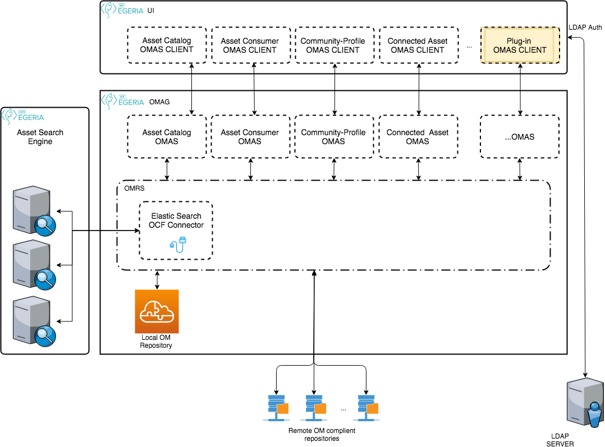

<!-- SPDX-License-Identifier: CC-BY-4.0 -->
<!-- Copyright Contributors to the ODPi Egeria project. -->

# Asset Catalog Open Metadata Access Service (OMAS)

The Asset Catalog OMAS provides services to search for data assets.

The search locates assets based on the content of the Asset metadata itself and the metadata that links
to it.

The Asset Catalog REST API supports:
* the retrieval of assets based on unique identifiers
* the retrieval of asset's relationships and classifications
* to query for related assets
* the retrieval of assets based on their type

* [Documentation](https://egeria-project.org/services/omas/asset-catalog/overview)

## Design Information

The module structure for the Asset Catalog OMAS is as follows:

* [asset-catalog-client](asset-catalog-client) supports the client library.
* [asset-catalog-api](asset-catalog-api) supports the common Java classes that are used both by the client and the server.
* [omas-asset-catalog-server](asset-catalog-server) supports the server side implementation of the access service.
 This includes the
  * interaction with the [administration services](../../admin-services) for
    registration, configuration, initialization and termination of the access service.
  * interaction with the [repository services](../../repository-services) to work with open metadata from the
    [cohort](https://egeria-project.org/concepts/cohort-member).
  * support for the access service's API and its related event management.
* [omas-asset-catalog-spring](asset-catalog-spring) supports the REST API using the [Spring](../../../developer-resources/Spring.md) libraries.
* [asset-catalog-topic-connector](asset-catalog-topic-connector) supports asynchronous messaging through a connector
and connector provider class

### Search solution
The search will return entities that match the search criteria.
As the asset search is to be performed against on one or more repositories a search engine will be used. 
The search will be performed using the existing properties of the entity.
Indexing will be performed by the Asset Catalog OMAS according to supported zones.
The search result will contain: guid, name (name or displayName), description, qualifiedName, classifications, zoneMembership (the basic properties of the element).

In order to get the full context of the element, a second call is performed.
At this step, the specific relationships are traverse for getting the connection to the asset and to get the schema type that is behind the given asset.
This call is using the asset global identifier and the asset type. 

> Figure 1: The integration of the search engine

### Other Services
Asset Catalog OMAS provides services to fetch the asset's:
* classifications
* relationships
* specific entities that connect two assets
* relationships between two known entities 
* related assets 

----
Return to the [access-services](..) module.

----
License: [CC BY 4.0](https://creativecommons.org/licenses/by/4.0/),
Copyright Contributors to the ODPi Egeria project.
