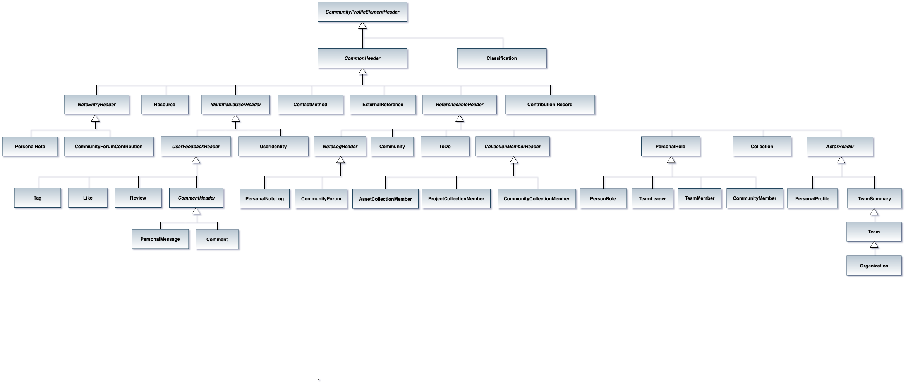

<!-- SPDX-License-Identifier: CC-BY-4.0 -->
<!-- Copyright Contributors to the ODPi Egeria project. -->

## Community Profile OMAS Beans

The Community Profile OMAS beans provide the object structures for
sending related collections of properties.
The beans are used on APIs and in events.

Each bean is
annotated with Jackson databind annotations so it can be serialized
between JSON and Java.

The beans are all related and ultimately inherit from
[CommunityProfileElementHeader](community-profile-element-header-bean.md).

This is the class hierarchy:

> 

Beans with "Header" in their name are abstract classes.
The others appear in the API or form part of an event structure.

The beans are listed in alphabetical order below:

* [ActorHeader](community-profile-beans-ActorHeader.md) - common header for people and teams.
* [AssetCollectionMember](community-profile-beans-AssetCollectionMember.md) - asset details for an asset in a favorite collection.
* [Classification](community-profile-beans-Classification.md) - contains the properties of a single classification.
* [Collection](community-profile-beans-Collection.md) - anchor for a collection of favorite things.
* [CollectionMemberHeader](community-profile-beans-CollectionMemberHeader.md) - header for a member of a collection of favorite things.
* [CollectionStatus](community-profile-beans-CollectionStatus.md) - request value for the members of a collection to select.
* [Comment](community-profile-beans-Comment.md) - details of a comment including links to its replies.
* [CommentHeader](community-profile-beans-CommentHeader.md) - comment header for comments and personal messages.
* [CommonHeader](community-profile-beans-CommonHeader.md) - provides the link to the guid and type of element extracted from the open metadata repositories.
* [Community](community-profile-beans-Community.md) - details of a community.
* [CommunityCollectionMember](community-profile-beans-CommunityCollectionMember.md) - summary details of a community in a favorite collection
* [CommunityForum](community-profile-beans-CommunityForum.md) - details of a forum attached to a community.
* [CommunityForumContribution](community-profile-beans-CommunityForumContribution.md) - details of an entry in a forum.
* [CommunityMember](community-profile-beans-CommunityMember.md) - summary details of a person who is a member of a community.
* [ContactMethod](community-profile-beans-ContactMethod.md) - information on how to contact a person.
* [ExternalReference](community-profile-beans-ExternalReference.md) - URL to an external document or resource.
* [IdentifiableUserHeader](community-profile-beans-IdentifiableUserHeader.md) - provides a common header for elements that are associated with a single userId.
* [Like](community-profile-beans-Like.md) - a like attached to an element from a single user.
* [NoteEntryHeader](community-profile-beans-NoteEntryHeader.md) - the common header for a personal note or forum contribution.
* [NoteLogHeader](community-profile-beans-NoteLogHeader.md) - the common header for personal notes or a community forum.
* [Organization](community-profile-beans-Organization.md) - an anchor for a departmental hierarchy.
* [PersonalMessage](community-profile-beans-PersonalMessage.md) - details of a personal message that is attached to a personal profile.
* [PersonalNote](community-profile-beans-PersonalNote.md) - a personal note.
* [PersonalNoteLog](community-profile-beans-PersonalNoteLog.md) - the collection of personal notes for a personal profile.
* [PersonalProfile](community-profile-beans-PersonalProfile.md) - information about an individual.
* [PersonRole](community-profile-beans-PersonRole.md) - description of a role that someone is appointed to.
* [ProjectCollectionMember](community-profile-beans-ProjectCollectionMember.md) - a favorite project.
* [ReferenceableHeader](community-profile-beans-ReferenceableHeader.md) - provides the common properties found in objects that inherit from Referenceable.
* [Resource](community-profile-beans-Resource.md) - a resource for a person or a community.
* [Review](community-profile-beans-Review.md) - a review for a personal note or community forum contribution.
* [Tag](community-profile-beans-Tag.md) - an informal tag for many types of element.
* [Team](community-profile-beans-Team.md) - a description of a team.
* [TeamLeader](community-profile-beans-TeamLeader.md) - the leader of a team.
* [TeamMember](community-profile-beans-TeamMember.md) - a member of a team.
* [TeamSummary](community-profile-beans-TeamSummary.md) - summary information about a team.
* [ToDo](community-profile-beans-ToDo.md) - an action item.
* [UserFeedbackHeader](community-profile-beans-UserFeedbackHeader.md) - common header for tags, reviews, comments and likes.
* [UserIdentity](community-profile-beans-UserIdentity.md) - information about a person's user id.

----
License: [CC BY 4.0](https://creativecommons.org/licenses/by/4.0/),
Copyright Contributors to the ODPi Egeria project.