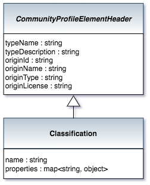

<!-- SPDX-License-Identifier: CC-BY-4.0 -->
<!-- Copyright Contributors to the ODPi Egeria project. -->

# Classification bean

The Classification bean holds details of a single classification
that can be associated with any entity from the
open metadata repositories.

> 

Each classification has a name and properties.

The Classification bean is attached to all beans that
inherit from [ReferenceableHeader](community-profile-beans-ReferenceableHeader.md) 

----
License: [CC BY 4.0](https://creativecommons.org/licenses/by/4.0/),
Copyright Contributors to the ODPi Egeria project.