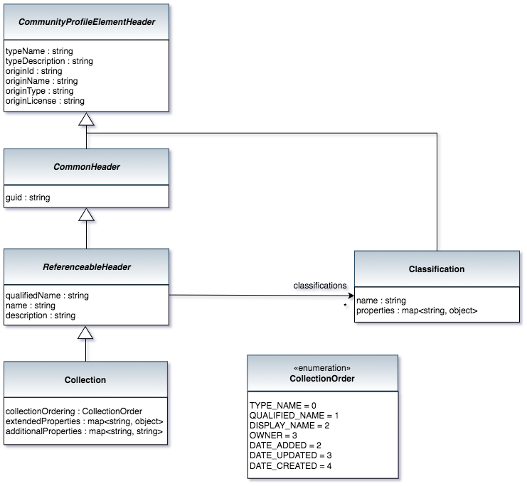

<!-- SPDX-License-Identifier: CC-BY-4.0 -->
<!-- Copyright Contributors to the ODPi Egeria project. -->

# Collection Bean

The Collection bean manages an anchor to attach the members of a collection.
The resulting collection that then be reused in multiple resource lists.

> 

----
License: [CC BY 4.0](https://creativecommons.org/licenses/by/4.0/),
Copyright Contributors to the ODPi Egeria project.