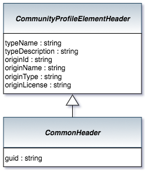

<!-- SPDX-License-Identifier: CC-BY-4.0 -->
<!-- Copyright Contributors to the ODPi Egeria project. -->

# CommonHeader Bean

The CommonHeader provides the link to the guid and
type of element extracted from the open metadata repositories.

> 

It has 3 properties:

* guid - unique identifier of the element form the open metadata repository.
* typeName - specific name of the type of the element.
* typeDescription - short description of the type.

----
License: [CC BY 4.0](https://creativecommons.org/licenses/by/4.0/),
Copyright Contributors to the ODPi Egeria project.