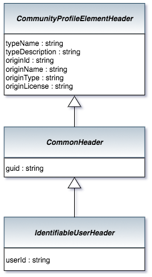

<!-- SPDX-License-Identifier: CC-BY-4.0 -->
<!-- Copyright Contributors to the ODPi Egeria project. -->

# IdentifiableUserHeader Bean

The IdentifiableUserHeader provides a common header for elements
that are associated with a single userId.

> 

This bean adds the userId property.

----
License: [CC BY 4.0](https://creativecommons.org/licenses/by/4.0/),
Copyright Contributors to the ODPi Egeria project.