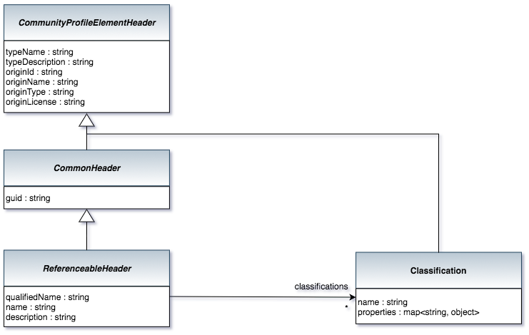

<!-- SPDX-License-Identifier: CC-BY-4.0 -->
<!-- Copyright Contributors to the ODPi Egeria project. -->

# ReferenceableHeader Bean

The ReferenceableHeader provides the common properties found in objects that inherit from
Referenceable in the open metadata types.
Generally it represents a significant element that has its own unique name.

> 

----
License: [CC BY 4.0](https://creativecommons.org/licenses/by/4.0/),
Copyright Contributors to the ODPi Egeria project.