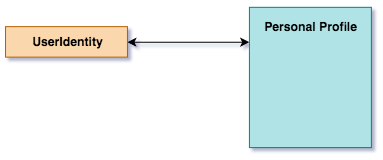
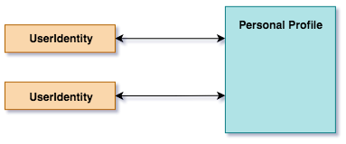
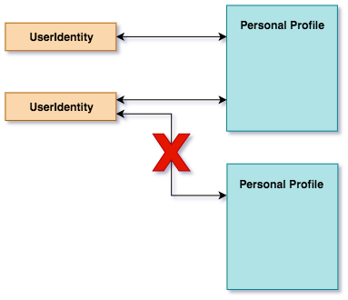
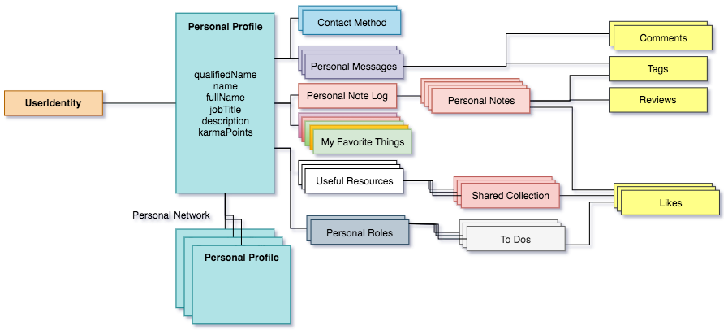

<!-- SPDX-License-Identifier: CC-BY-4.0 -->
<!-- Copyright Contributors to the ODPi Egeria project. -->

# Personal Profile

A personal profile provides a place for an individual to share information about themselves
with the other people they are collaborating with.  It is associated with one or more
of the person's userIds.

Each userId is linked to the profile as a [UserIdentity](user-identity.md) object.

> 

There can be more than one userId for a profile (for example if a user has an administrator userId and a normal userId)
> 

However, the same userId can not be linked to two profiles.

> 

This means we can retrieve a profile from the UserId.

Each profile has a qualified name that should uniquely identify the
individual.  For example, an employee identifier.

There is space to provide the name the individual wants to be
known as, and their full name, along with a job title.

An individual can also maintain collections of their
favourite Assets, Projects and Communities and control notifications
about changes to the member of these lists.

> 

## Working with personal profiles

* [Retrieving my personal profile](../scenarios/retrieving-my-personal-profile.md)
* [Creating my personal profile](../scenarios/creating-my-personal-profile.md)
* [Updating my personal profile](../scenarios/updating-my-personal-profile.md)
* [Removing my personal profile](../scenarios/removing-my-personal-profile.md)

* [Retrieving a personal profile for another user](../scenarios/finding-a-person.md)

* [Loading personal profiles of existing members of an organization](../scenarios/loading-personal-profiles.md)
* [Synchronizing updates to personal profiles from another system](../scenarios/synchronizing-personal-profiles.md)

----
License: [CC BY 4.0](https://creativecommons.org/licenses/by/4.0/),
Copyright Contributors to the ODPi Egeria project.