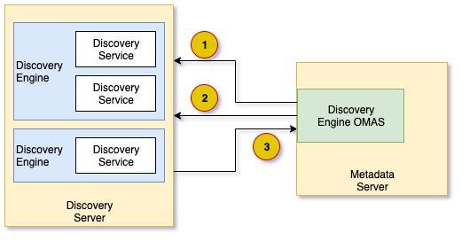
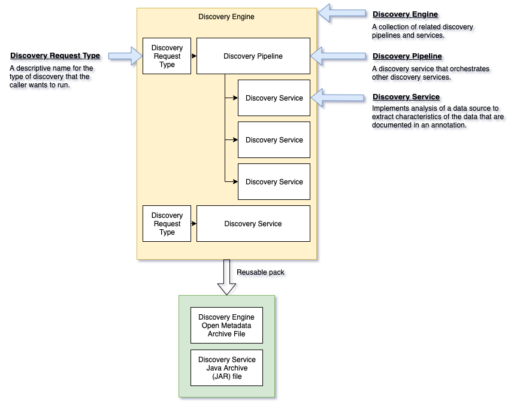

<!-- SPDX-License-Identifier: CC-BY-4.0 -->
<!-- Copyright Contributors to the ODPi Egeria project. -->

# Discovery Engine Open Metadata Access Service (OMAS)

The Discovery Engine OMAS provides APIs and events for metadata discovery tools
that are surveying the data landscape and recording information in
metadata repositories.

These types of tools are called
[Discovery Engines](../../frameworks/open-discovery-framework/docs/discovery-engine.md)
in the [Open Discovery Framework (ODF)](../../frameworks/open-discovery-framework),
which is why this access service is called the Discovery Engine OMAS.

The Open Discovery Framework (ODF) provides a comprehensive set of
open APIs that describe the interaction between metadata discovery tools
and a metadata server.  The aim is to make it easy for
metadata discovery tools to work with open metadata
repositories.

The capabilities defined in the ODF fall into 4 broad
categories.

* The **metadata server APIs** - these are implemented by the Discovery Engine OMAS and include:
  * Discovery configuration API - for configuring discovery engines and services - and
    also retrieving this configuration.
  * Asset catalog API - for finding assets in the metadata repository.
  * Asset store API - for retrieving a specific asset's metadata and connector.
  * Annotation store API - for storing new metadata about the asset.
* The **discovery services** - these are the specialist plugin services that each perform a particular type of analysis.
  These are implemented by the metadata discovery tool (or interface with the discovery tool's APIs to drive specific types of analysis).
* The **discovery engines** - these manage the work of a collection of related discovery services.
* The **discovery server** - this hosts one or more discovery engines.  It provides a REST API
  to request specific analysis on particular assets, monitor progress of the
  discovery services and review the results.  In Egeria, the discovery server
  is implemented by the [Asset Analysis OMES](../../engine-services/asset-analysis)
  running in an [engine host](../../admin-services/docs/concepts/engine-host.md).

Figure 1 shows how these capabilities work together.

> **Figure 1:** Interfaces of the Discovery Engine OMAS

1. The engine host server retrieves configuration from the Governance Engine OMAS.
2. When a discovery engine receives a request to analyse an asset, it
   retrieves the annotations from previous analysis of this asset.
3. While the discovery service is running, it is writing new annotations about
   the asset through the Discovery Engine OMAS.   

More details of this processing follows.

## Discovery Engine Configuration 

The configuration of the discovery engines and the discovery services
that they support are managed in the metadata server through
the [Governance Engine OMAS](../governance-engine).

The [Engine Host OMAG Server](../../admin-services/docs/concepts/engine-host.md) is typically
located close to the data assets to minimize the network traffic
resulting from the analysis.  Where the data assets are
distributed in multiple locations, it is possible to
deploy an Engine Host server in each location so the
discovery workload is kept close to the data.

A single Discovery Engine OMAS can support multiple
engine hosts deployed in this way.

The [Asset Analysis OMES](../../engine-services/asset-analysis) on the engine host server is configured
with the location of the metadata server where the Discovery Engine OMAS
is running along with the names of the discovery engines it will host.
The same discovery engine can simultaneously run on multiple
engine host servers.  This means the Asset Analysis OMES
can host all of the discovery engines it needs to analyse
the assets at its location.

When the Asset Analysis OMES starts in the engine host, it calls the Governance
Engine OMAS to retrieve the configuration for each of its
discovery engines (see Figure 1, number 1).
It also connects to the Governance Engine
OMAS's out topic to receive any updates on this configuration
while it is running.

Within the discovery engine's configuration are the list of 
[discovery request types](../../frameworks/open-discovery-framework/docs/discovery-request-type.md) it supports that are in turn each linked to the
discovery service that should run when one of these discovery
types is requested to be run against a specific asset.
This is shown in figure 2.

> **Figure 2:** Discovery Engine Configuration

## Processing Discovery Requests

When a discovery request is made, the discovery engine creates an instance
of the discovery service and gives it access to a
[discovery context](../../frameworks/open-discovery-framework/docs/discovery-context.md).
The discovery context provides access to existing metadata known about the Asset, a connector
to access the data stored in the asset and a store to
record the new metadata it has discovered about the asset.
Behind the scenes, the discovery context is calling
the Discovery Engine OMAS to both retrieve metadata
about the Asset and its connector (see Figure 1, number 2),
and to store the new metadata (Figure 1, number 3).

## Further Information

The [Open Discovery Framework (ODF)](../../frameworks/open-discovery-framework)
provides more information about the discovery engines and
discovery services along with the metadata APIs.

In Egeria, both the metadata server where the Discovery Engine OMAS runs
and the engine host whether the Asset Analysis OMES runs are types of [OMAG Servers](../../../open-metadata-publication/website/omag-server/omag-server.md).
More information on the operation of the engine host
can be found under the [Engine Services](../../engine-services).

An overview of automated metadata discovery approaches is available
[here](../../../open-metadata-publication/website/metadata-discovery).

## Design information

The module structure for the Discovery Engine OMAS is as follows:

* [discovery-engine-client](discovery-engine-client) supports the client library that is used by
the discovery server (and the discovery engines and discovery services it hosts) to
access the Discovery Engine OMAS's REST API and out topic.

* [discovery-engine-api](discovery-engine-api) supports the common Java classes that are used both by the client and the server.
Since the Open Discovery Framework (ODF) defines most of the
interfaces for the Discovery Engine OMAS, this module only needs to provide the
interfaces associated with the out topic.

* [discovery-engine-server](discovery-engine-server) supports in implementation of the metadata interfaces
defined by the Open Discovery Framework (ODF) and its related event management.

* [discovery-engine-spring](discovery-engine-spring) supports the REST API using the [Spring](../../../developer-resources/Spring.md) libraries.
This module has no business logic associated with it.
Each REST API endpoint delegates immediately to an
equivalent function in the server module.
It is, however, a useful place to look to get a view of the
REST API supported by this OMAS.

----
Return to the [access-services](..) module.

----
License: [CC BY 4.0](https://creativecommons.org/licenses/by/4.0/),
Copyright Contributors to the ODPi Egeria project.

