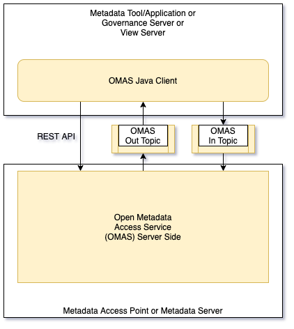
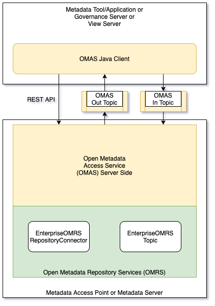
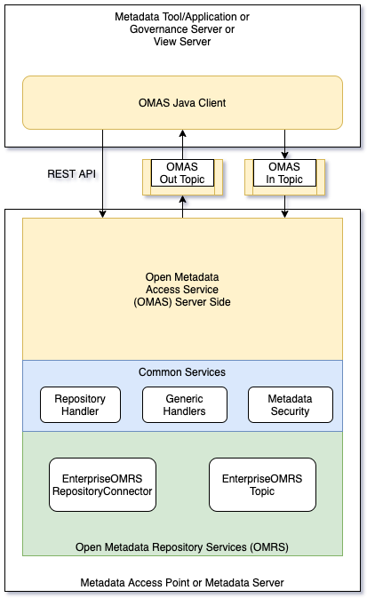

<!-- SPDX-License-Identifier: CC-BY-4.0 -->
<!-- Copyright Contributors to the ODPi Egeria project. -->

# Inside an OMAS

Although each OMAS provides a unique API, the internal structure
of each OMAS is pretty similar.  

Typically an OMAS supports a Java client interface that runs locally in the metadata tool,
service, or application.  These client interfaces support both synchronous
and asynchronous calls to the OMAS server-side.

For callers that do not use Java, behind the client there is an OMAS REST API and an
event notification interface (typically supported
by [Apache Kafka](https://kafka.apache.org/)) that can be called directly. 
The event notification interface for each OMAS has a topic to
allow an external caller to post metadata updates to the open metadata
repositories (OMAS In Topic) and another topic (OMAS Out Topic) to receive
relevant updates that have come from other parts of the
open metadata and governance ecosystem.

Today, direct calls to the REST APIs and topics are not guaranteed
to be backward compatible.  They are also not documented.
However we are moving to a position where these interfaces are
both documented and supported.  The change in their disposition will
occur when the documentation is contributed.

The interfaces are illustrated in Figure 1:

> Figure 1: Interfaces of an Open Metadata Access Service (OMAS)

The OMAS receives metadata from the
[Open Metadata Repository Cohort](../../../admin-services/docs/concepts/cohort-member.md)
through the [Open Metadata Repository Services (OMRS)](../../../repository-services).

Figure 2 shows the repository services.

> Figure 2: Calling the repository services

The OMRS subsystem called the enterprise repository services offers both an Enterprise OMRS Repository
Connector and Enterprise OMRS Topic.  The Enterprise OMRS Repository Connector queries all repositories
in the cohorts that the local server is connected to.  The Enterprise OMRS Topic aggregates
events from all connected cohorts.

The OMAS is passed the enterprise repository service objects at initialization. 
It can then register a listener with the Enterprise OMRS Topic to receive the cohort events.

While running, the OMAS can call the Enterprise OMRS Repository Connector
directly.  However, there are many common functions that all OMASs need and these
are provided by the [common services](../../../common-services).

Figure 3 shows the common services.

> Figure 2: Using the common services

The common services provide most of the metadata management implementation logic for the
OMASs.  This means that the code in each OMAS's modules is able to
focus on supporting its specific interfaces and mapping them to the common services.

 * The [Repository Handler](../../../common-services/repository-handler) provides an object oriented interface over
the Enterprise OMRS Repository Connector.

 * The [Generic Handlers](../../../common-services/generic-handlers) provide support for maintaining and accessing
specific [Open Metadata Types](../../../../open-metadata-publication/website/open-metadata-types).
(such as Asset, Connection, ...).  They also
support calls to metadata security, visibility of metadata based on
governance zones and the maintenance of [anchorGUIDs](../concepts/anchor.md) in
dependent instances.

 * [Metadata security](../../../common-services/metadata-security) manages calls to the 
OpenMetadataServerSecurityConnector if it is installed in the server.

## Further Information

* [Design Guidelines for an OMAS](access-services-design-guidelines.md)

* Design Documentation for specific OMASs
   * [Asset Consumer](../../asset-consumer/docs/design)
   * [Asset Owner](../../asset-owner/docs/design)
   * [Community Profile](../../community-profile/docs/design)
   * [Data Engine](../../data-engine/docs/design)
   * [Digital Architecture](../../digital-architecture/docs/design)
   
* [Design documentation for the OMRS](../../../repository-services/docs)

----
License: [CC BY 4.0](https://creativecommons.org/licenses/by/4.0/),
Copyright Contributors to the ODPi Egeria project.