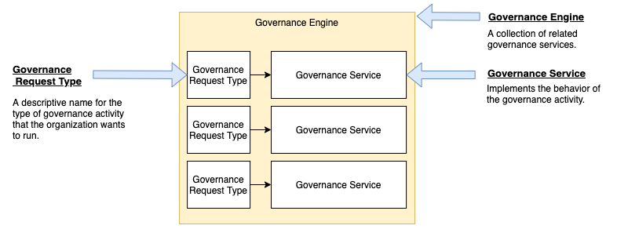

<!-- SPDX-License-Identifier: CC-BY-4.0 -->
<!-- Copyright Contributors to the ODPi Egeria project. -->

# Governance Request Type

The governance request type defines the descriptive name of a specific
governance activity that the organization wishes to run.

The request type is mapped to a [governance service](governance-service.md) implementation
along with request parameters to configure the behaviour of the service
in a [governance engine definition](governance-engine.md) as shown in
Figure 1.

> **Figure 1:** Governance request types as part of a governance engine definition

Governance services are run by the
[Open Metadata Engine Services (OMES)](../../../../engine-services)
in an [Engine Host](../../../../admin-services/docs/concepts/engine-host.md)
OMAG Server.  The [Engine Host Services](../../../../governance-servers/engine-host-services)
called the [Governance Engine OMAS](../..)

They are used by the [Governance Engines](governance-engine.md)
to determine which [Governance Service](governance-service.md)
to run.

## Related Information

The Open Metadata Types model 
**[0461 Governance Action Engines](../../../../../open-metadata-publication/website/open-metadata-types/0461-Governance-Engines.md)**
shows how the request type links the governance engine to the
governance service via the **SupportedGovernanceService** relationship.

----

* [Return to Governance Engine OMAS Concepts](.)
* [Return to Governance Engine OMAS Overview](../..)

----
License: [CC BY 4.0](https://creativecommons.org/licenses/by/4.0/),
Copyright Contributors to the ODPi Egeria project.