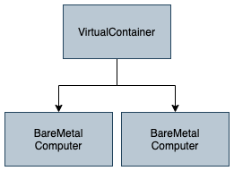
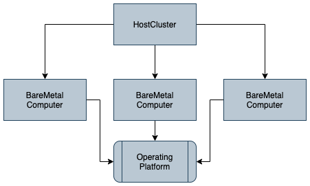
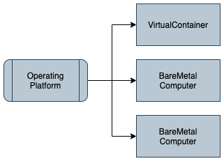
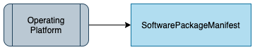
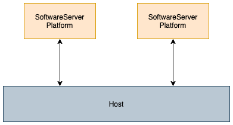
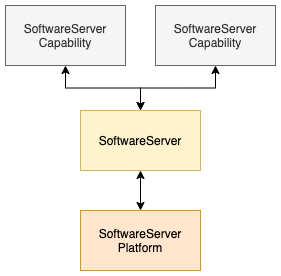
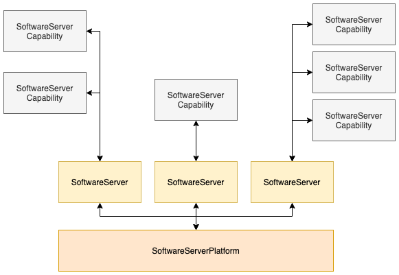
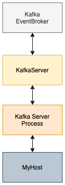

<!-- SPDX-License-Identifier: CC-BY-4.0 -->
<!-- Copyright Contributors to the ODPi Egeria project. -->

# IT Infrastructure Open Metadata Access Service (OMAS)

The IT Infrastructure OMAS provides APIs for tools and applications managing the
IT infrastructure that supports the data assets and software.

It is typically used by the
[Infrastructure Integrator OMIS](../../integration-services/infrastructure-integrator)
to capture metadata from deployment artifacts, or to generate
deployment artifacts from open metadata.

The other major use of IT Infrastructure OMAS is
to manually catalog the key pieces of IT Infrastructure used by an organization.
Often the creation of this metadata is used to kick of the
automated cataloging of the capabilities and assets associated
with the infrastructure using the [Integration Daemon](../../admin-services/docs/concepts/integration-daemon.md).

## Basic Concepts

At the base is the notion of a **Host**.  This could be:
 * **BareMetalComputer** - traditional computer hardware or 
 * **VirtualMachine** - a virtualized machine (such as VMWare or VirtualBox) that uses a hypervisor to virtualize machine hardware or 
 * **VirtualContainer** - a software system using a container library to virtualize the operating system it uses or 
 * **HostCluster** - a cluster of Hosts that are operating as a single operational environment (such as a Hadoop cluster or kubernetes cluster).

Hosts are composable and reusable.  For example, figure 1 shows a Virtual Container that
is deployed to two Bare Metal Computers.  The relationship between them is called **HostedHost**.

> **Figure 1:** A virtual container deployed to two bare metal computers

Figure 2 shows an example of Host Cluster, such as a Hadoop Cluster, that manages multiple
Hosts (Bare Metal Computers in this example).  The relationship between the
Host Cluster and each subordinate Host is 
**HostClusterMember**.  The host cluster may not have all of its members
active.  The membership denotes the pool of resources that the cluster has
to work with.

> **Figure 2:** A cluster of bare metal computers operating as single host

A Host typically runs an operating system and may have various hardware characteristics of interest (such as byte ordering).
Collectively this information is called the **OperatingPlatform**.
The Operating Platform can be linked to many hosts through the **HostOperatingPlatform** relationship.
This is shown in figure 2 and figure 3.
It documents that these hosts are running the software identified by the operating platform.
This is particularly useful if you using standard
software stack builds that are deployed to multiple
hosts since it is easy to see which hosts are at which levels of the software
and to manage the rollout of upgrades to the stack. 

> **Figure 3:** A collection of hosts using the same operating platform

The **SoftwarePackageManifest** shown in figure 4 details the software stack for the
operating platform.  It is represented as a **Collection**
linked to the operating platform using the **OperatingPlatformManifest** relationship.

> **Figure 4:** The software stack definition for an operating platform

Hosts often have storage associated with them.  The same storage volume may be used by
multiple hosts.  This is shown in figure 5
Linked to a Host via the **SoftwareServerPlatformDeployment** are the
**SoftwareServerPlatform**s.  They describe the running
processes running on the Host that use software described in the Operating Platform.
This is shown in figure 5.

> **Figure 5:** The software server platforms running on the host

The **SoftwareServerPlatform** itself may run one or many **SoftwareServers** where a
Software Server is a collection of **SoftwareServerCapabilities** 
that access the operating system through the software server platform.
The Software Server Capabilities deliver the function of the server.
They typically host/manage assets such as **DataSets**, **DataStores** and **Processes**
that are linked to the Software Server Capability using the **ServerAssetUse** relationship.

Some technologies are written as a single stack.
This means there is a single Software Server for the Software Server Platform.
Figure 6 shows the structure of the metadata elements
for a technology - such as Apache Kafka or a Database Server - that is a single stack.

> **Figure 6:** The metadata elements to represent a single stack technology

Figure 7 shows the representation of the stack
of a platform that allows multiple servers to be configured.
Egeria's OMAG Server Platform is an example of this type of technology.
The Software Servers are OMAG Servers and the registered services:
Open Metadata Access Services (OMASs),
Open Metadata Engine Services (OMESs),
Open Metadata Integration Services (OMISs) and
Open Metadata View Services (OMVSs)
are Software Server Capabilities of types:
**MetadataAccessService**, **EngineHostingService**, **MetadataIntegrationService** and
**UserViewService** respectively.

> **Figure 7:** The metadata elements to represent a configurable software server platform

### Software Server Capabilities

There are many types of software server capability. The list below
contains the Software Server Capabilities defined in the open metadata types.

These are the software server capabilities defined in the open types:

* **APIManager** - A capability that manages callable APIs that typically delegate onto Software Services.
* **Application** - A capability supporting a specific business function.
* **Catalog** - A capability that manages collections of descriptions about people, places, digital assets, things, ...
* **DataManager** - A capability that manages collections of data.
* **Engine** - A programmable engine for running automated processes.
   * **Workflow Engine** - An engine capable of running a mixture of human and automated tasks as part of a workflow process.
   * **Reporting Engine** - An engine capable of creating reports by combining information from multiple data sets.
   * **Analytics Engine** - An engine capable of running analytics models using data from one or more data sets.
   * **Data Movement Engine** - An engine capable of copying data from one data store to another.
   * **Data Virtualization Engine** - An engine capable of creating new data sets by dynamically combining data from one or more data stores or data sets.
* **EventBroker** - A capability that supports event-based services, typically around topics.
* **Software Services** - A capability that provides externally callable functions to other services.
   * **Application Service** - A software service that supports a reusable business function.
   * **Metadata Integration Service** - A software service that exchanges metadata between servers.
   * **Metadata Access Service** - A software service that provides access to stored metadata.
   * **Engine Hosting Service** - A software service that provides services that delegate to a hosted engine.
   * **User View Service** - A software service that provides user interfaces access to digital resources.
* **Network Gateway** - A connection point enabling network traffic to pass between two networks.
* **Database Manager** - A capability that manages data organized as relational schemas.
* **Enterprise Access Layer** - Repository services for the Open Metadata Access Services (OMAS) supporting federated queries and aggregated events from the connected cohorts.
* **Cohort Member** - A capability enabling a server to access an open metadata repository cohort.
* **Governance Engine** - A collection of related governance services of the same type.
   * **Governance Action Engine** - A collection of related governance services supporting the Governance Action Framework (GAF).
   * **Open Discovery Engine** - A collection of related governance services supporting the Open Discovery Framework (ODF). 

In addition it is possible to augment software server capabilities with classifications.
The following classifications are typically associated with the **DataManager**:

* **Content Collection Manager** - A manager of controlled documents and related media.
* **File System** - A capability that supports a store of files organized into a hierarchy of file folders for general use.
* **File Manager** - A manager of a collection of files and folders.

The following are more generally applied.
* **Notification Manager** - A server capability that is distributing events from a topic to its subscriber list.
* **Cloud Service** - A capability enabled for a tenant on a cloud platform.

### Technology Examples

Using the basic concepts described above, here are some examples
of metadata for different types of technologies.

Figure 8 shows the example of the software stack for Apache Kafka.

> **Figure 8:** The metadata elements to represent a Kafka Server

### Attachments and Classifications

* Locations
* Zones
* Ownership
* External References

## Infrastructure Managers

When the IT Infrastructure OMAS is capturing metadata from deployment artifacts
that are managed wholly by a specific technology or automated process,
this technology should be catalogued as a **SoftwareServerCapability**
and its guid and qualifiedName passed as the infrastructureManagerGUID and infrastructureManagerName
parameters on the API.  This will mark the metadata elements as managed by an external source
which makes the metadata read-only to all but the caller
responsible for cataloguing the artifact.

Where Egeria is the primary catalog of the infrastructure metadata,
or deployment artifacts that the metadata is derived from are either manually created
or maintained by multiple process, the infrastructure manager identifiers are left blank
so the resulting metadata elements are editable by any authorized caller.

See [Metadata Provenance](../../../open-metadata-publication/website/metadata-provenance)
for more information about the use of external source identifiers.

## Module Design

The module structure for the IT Infrastructure OMAS is as follows:

* [it-infrastructure-client](it-infrastructure-client) supports the client library.
* [it-infrastructure-api](it-infrastructure-api) supports the common Java classes that are used both by the client and the server.
* [it-infrastructure-server](it-infrastructure-server) supports in implementation of the access service and its related event management.
* [it-infrastructure-spring](it-infrastructure-spring) supports the REST API using the [Spring](../../../developer-resources/Spring.md) libraries.

----
Return to the [access-services](..) module.

----
License: [CC BY 4.0](https://creativecommons.org/licenses/by/4.0/),
Copyright Contributors to the ODPi Egeria project.

