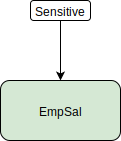
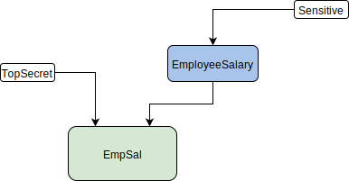
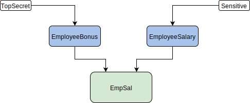

<!-- SPDX-License-Identifier: CC-BY-4.0 -->
<!-- Copyright Contributors to the ODPi Egeria project. -->
# Tag Propagation 
## Introduction
This document aims to explain how tag propagation will be handled within Governance Engine OMAS. 

The terms tag and 
classification should be treated interchangeably....

Tag propagation is the process by which we figure out which classifications should apply to a particular asset.

For example a classification may be associated directly with an asset, or instead an asset may be associated with a 
business term that itself is classified.

We also have to resolve conflicts.

A series of scenarios will be presented.
## Scenarios
### Direct Classification

The Asset (EmpSal) is classified as Sensitive
This is a direct classification, exactly once,  - there is nothing to resolve
This classification will be exposed via GE-omas against the EmpSal resource
### Direct Multiple Classification

The Asset (EmpSal) is classified as Sensitive and TopSecret.
This is invalid - there should only be a single governance classification applied.
No attempt will be made to reconcile these multiple classifications - ie to determine which should take precedence, which is most restrictive, are they the same etc.
instead as this is an error, the asset will not be exposed at GE-omas at all.
An Audit log entry will be created reporting the error.

### Classification via Business Term

The EmpSal asset is assigned the business term 'EmployeeSalary' which gives it meaning.
This business term is classified as Sensitive, so the resultant classification for EmpSal is Sensitive

### Classification via Business Term and Directly

The EmpSal asset is assigned the business term 'EmployeeSalary' which gives it meaning.
This business term is classified as Sensitive
However the asset is also classified as Top Secret
Since this has narrower scope, and as long as it is the only direct classification, this will be used
So the resultant classification here is TopSecret.

### Classification via multiple business terms 

The Asset (EmpSal) is assigned the two business terms EmployeeBonus & EmployeeSalary
This is invalid - there should only be a single business term applied.
No attempt will be made to reconcile these multiple terms, or their classifications - ie to determine which should take precedence, which is most restrictive, are they the same etc.
instead as this is an error, the asset will not be exposed at GE-omas at all.
An Audit log entry will be created reporting the error.

## Reference material

### Cary Workshop

In November 2018 design meetings in Cary came up with the following diagrams, which hopefully have been explained and the points addressed in this document.

----
License: [CC BY 4.0](https://creativecommons.org/licenses/by/4.0/),
Copyright Contributors to the ODPi Egeria project.
