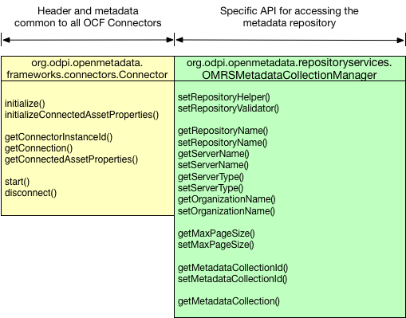

<!-- SPDX-License-Identifier: Apache-2.0 -->

# Overview of the Repository Connector Interface

In order for the Open Metadata Repository Services (OMRS) to be able to query and
distribute metadata from many different types of metadata repositories,
it needs a common interface for accessing these metadata repositories.
Most metadata repositories today have an external API already, so OMRS
uses the Open Connector Framework (OCF) to create a client-side common
interface for metadata repositories.
This interface is called the OMRS Repository Connector API.  

An OCF Connector is a java client for accessing an asset.
In the case of the OMRS Connector, the asset being accessed is a metadata repository. Figure 1 shows how the OMRS Repository Connector extends the OCF Connector API with the `OMRSMetadataCollectionConnector` interface to add the method to retrieve the metadata collection object.

> Figure 1: Additional OMRSMetadataCollectionConnector interface
