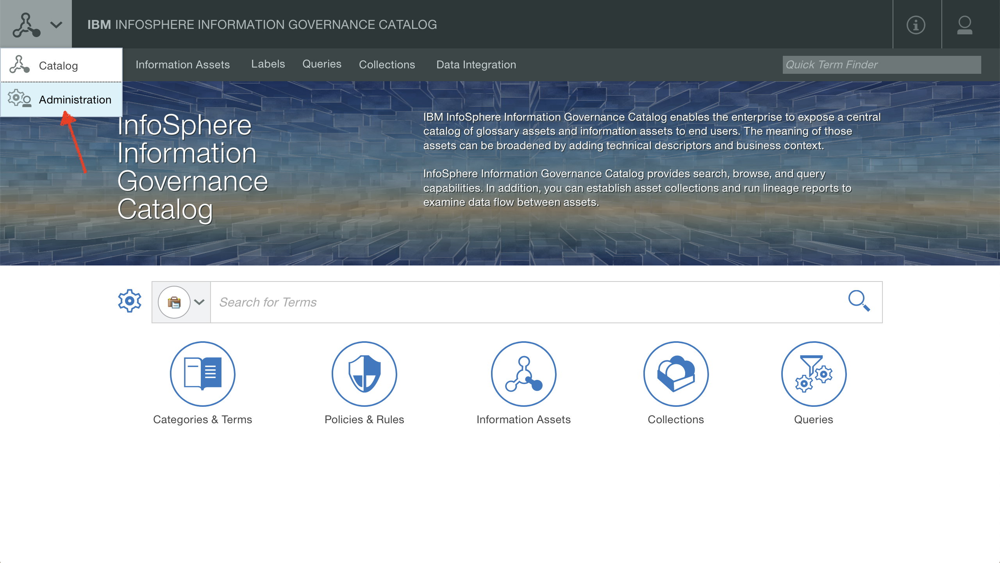
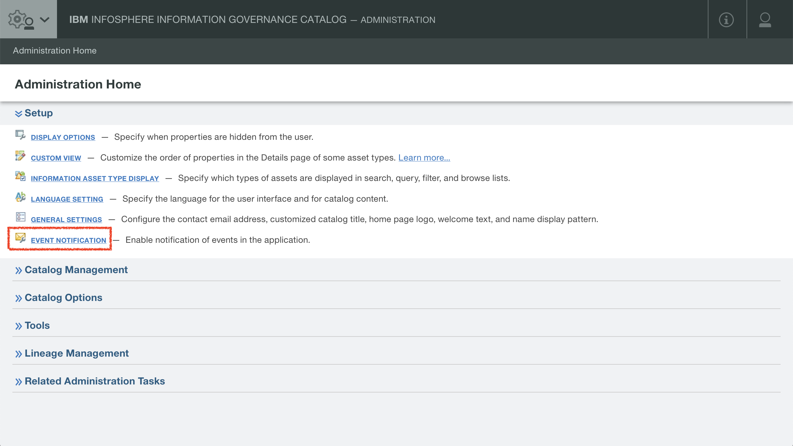
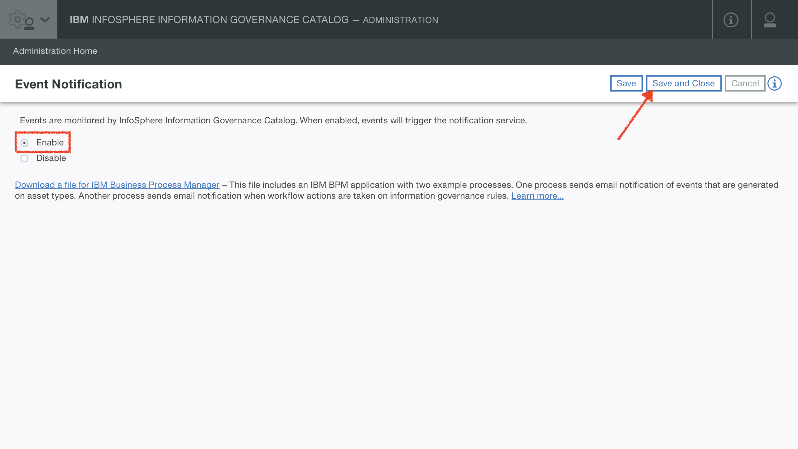

<!-- SPDX-License-Identifier: CC-BY-4.0 -->
<!-- Copyright Contributors to the ODPi Egeria project. -->

# IBM InfoSphere Information Governance Catalog Repository Connector

Provides an OMRS repository connector for IBM's InfoSphere Information Governance Catalog ("IGC").

## Getting started

To start using the connector, you will need an IGC environment, running either
version 11.5 or 11.7 of the software. (The connector will automatically detect
which version as part of its initialization.) You will need to first enable event
notification in your IGC environment:

1. Navigate to "Administration": 
1. Navigate to "Event Notification" within the "Setup" heading: 
1. Toggle "Enable" and then "Save and Close": 

There should not be any need to restart the environment after enabling the event
notification.

You will need to configure the OMAG server as follows (order is important). For 
example payloads and endpoints, see the [Postman samples](../../../../../../open-metadata-resources/open-metadata-samples/postman-rest-samples/README.md).

1. Configure your event bus for Egeria, by POSTing a payload like the following:

    ```json
    {
    	"producer": {
    		"bootstrap.servers":"localhost:9092",
    		"acks":"all",
    		"retries":"0",
    		"batch.size":"16384",
    		"linger.ms":"1",
    		"buffer.memory":"33554432",
    		"max.request.size":"10485760",
    		"key.serializer":"org.apache.kafka.common.serialization.StringSerializer",
    		"value.serializer":"org.apache.kafka.common.serialization.StringSerializer",
    		"kafka.omrs.topic.id":"cocoCohort"
    	},
    	"consumer": {
       		"bootstrap.servers":"localhost:9092",
       		"zookeeper.session.timeout.ms":"400",
       		"zookeeper.sync.time.ms":"200",
       		"fetch.message.max.bytes":"10485760",
       		"max.partition.fetch.bytes":"10485760",
       		"key.deserializer":"org.apache.kafka.common.serialization.StringDeserializer",
       		"value.deserializer":"org.apache.kafka.common.serialization.StringDeserializer",
       		"kafka.omrs.topic.id":"cocoCohort"
    	}
    }
    ```

    to:

    ```
    POST http://localhost:8080/open-metadata/admin-services/users/{{user}}/servers/{{server}}/event-bus?connectorProvider=org.odpi.openmetadata.adapters.eventbus.topic.kafka.KafkaOpenMetadataTopicProvider&topicURLRoot=OMRSTopic
    ```

1. Configure the cohort, by POSTing something like the following (the name of the cohort `cocoCohort` in this example
    should match the name used for the cohort in the payload in the previous step):

    ```
    POST http://localhost:8080/open-metadata/admin-services/users/{{user}}/servers/{{server}}/cohorts/cocoCohort
    ```

1. Configure the IGC connector, by POSTing a payload like the following:

    ```json
    {
    	"igcBaseURL": "https://my.igc.services.host.com:9445",
    	"igcAuthorization": "aXNhZG1pbjppc2FkbWlu"
    }
    ```

    to:
    
    ```
    POST http://localhost:8080/open-metadata/admin-services/users/{{user}}/servers/{{server}}/local-repository/mode/ibm-igc/details
    ```

    The payload should include the URL (including hostname and port) of your IGC environment's domain (services) tier,
    and the `igcAuthorization` should be set to a basic-encoded authorization string (`username:password`).

1. Configure the event mapper for IGC, by POSTing something like the following:

    ```
    POST http://localhost:8080/open-metadata/admin-services/users/{{user}}/servers/{{server}}/local-repository/event-mapper-details?connectorProvider=org.odpi.openmetadata.adapters.repositoryservices.igc.eventmapper.IGCOMRSRepositoryEventMapperProvider&eventSource=my.igc.services.host.com:59092
    ```

    The hostname provided at the end should be the host on which your IGC-embedded kafka bus is running, and include
    the appropriate port number for connecting to that bus. (For v11.5 this is your domain (services) tier and port `59092`,
    whereas in the latest versions of 11.7 it may be running on your Unified Governance / Enterprise Search tier, on port
    `9092`.)

1. The connector and event mapper should now be configured, and you should now be able
    to start the instance by POSTing something like the following:
   
   ```
   POST http://localhost:8080/open-metadata/admin-services/users/{{user}}/servers/{{server}}/instance
   ```

## How it works

The IBM IGC Repository Connector works through a combination of the following:

- IBM IGC's REST API, itself abstracted through the [IGC REST Client Library](igc-rest-client-library/)
- IBM InfoSphere Information Server's embedded Apache Kafka event bus
    - specifically the `InfosphereEvents` topic (hence the need to enable events in the setup)
- Some [IGC extensions](docs/ibm-igc-extensions.md) that implement specific additional functionality

----
License: [CC BY 4.0](https://creativecommons.org/licenses/by/4.0/),
Copyright Contributors to the ODPi Egeria project.
