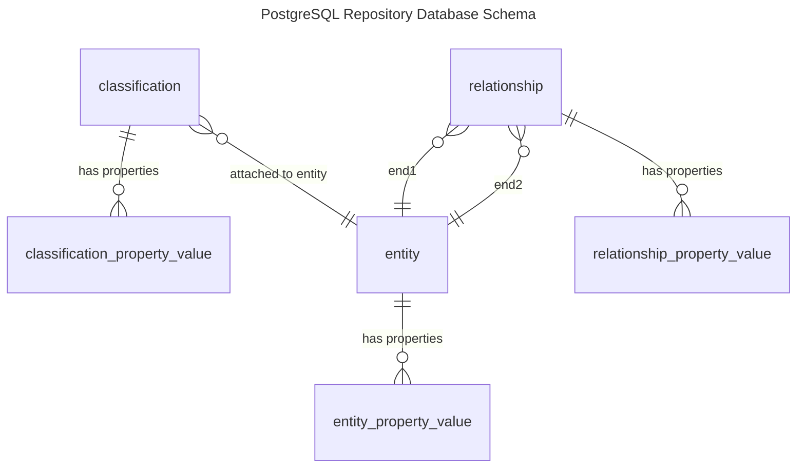

<!-- SPDX-License-Identifier: CC-BY-4.0 -->
<!-- Copyright Contributors to the ODPi Egeria project. -->


# PostgreSQL Repository Connector

The PostgreSQL OMRS Repository Connector provides a high-speed bi-temporal repository
implementation that stores the open metadata in a PostgreSQL Database Schema.  




## Debugging

Logging levels can be set up in the `application.properties` file.  To log each SQL command issues, add the following:

```
logging.level.org.odpi.openmetadata.adapters.connectors.resource.jdbc=DEBUG
```

To log how queries are built up from the values supplied on the repository API, add the following:

```
logging.level.org.odpi.openmetadata.adapters.repositoryservices.postgres.repositoryconnector.database=DEBUG
```


Detailed documentation is available on the [Egeria website](https://egeria-project.org/connectors/repository/postgres/overview/).


----
Return to the [open-metadata-collection-store-connectors](..)


----
License: [CC BY 4.0](https://creativecommons.org/licenses/by/4.0/),
Copyright Contributors to the ODPi Egeria project.
