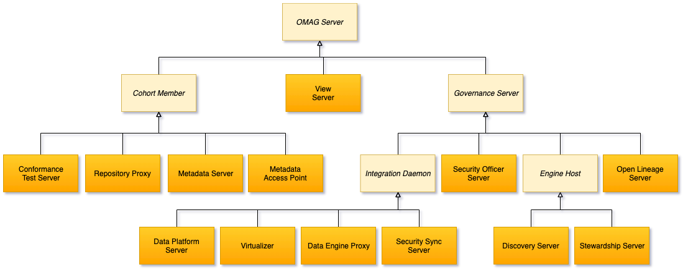

<!-- SPDX-License-Identifier: CC-BY-4.0 -->
<!-- Copyright Contributors to the ODPi Egeria project. -->

# Administration Services Concepts

The administration services manages the configuration of the
[Open Metadata and Governance (OMAG) Server Platform](omag-server-platform.md)
different subsystems within an [OMAG Server](omag-server.md).
It uses the following terms.

* [Configuration Document](configuration-document.md)
* [Configuration Document Store Connector](configuration-document-store-connector.md)
* [Event Bus](event-bus.md)

These are the different types of OMAG Servers that it supports:

* [OMAG Server](omag-server.md)
  * [Cohort Member](cohort-member.md)
    * [Conformance Test Server](conformance-test-server.png)

----
License: [CC BY 4.0](https://creativecommons.org/licenses/by/4.0/),
Copyright Contributors to the ODPi Egeria project.