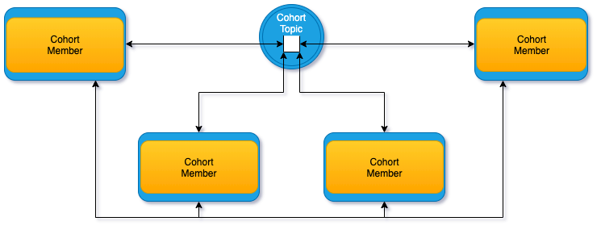

<!-- SPDX-License-Identifier: CC-BY-4.0 -->
<!-- Copyright Contributors to the ODPi Egeria project 2020. -->

# Cohort Member

A **Cohort Member** is an [OMAG Server](omag-server.md) that is capable of joining an
**open metadata repository cohort**.

The open metadata repository cohort (or cohort for short) is a group of OMAG servers that
are exchanging metadata using a peer-to-peer replication
protocol and federated queries.  This is shown in Figure 1.

> **Figure 1:** OMAG Servers connected via a cohort

The cohort is self-configuring.  At the heart of it is a shared
topic.  Each member puts a registration request on the topic when they want to join.
This is picked up by the existing members who add this new server to their
[registry of members](../../../repository-services/docs/component-descriptions/cohort-registry.md)
and re-send their registration information to allow the new member to build up its own registry.

When an OMAG server leaves the cohort, it sends an unregistration request.
This enables the other members to remove the parting member from their registries.

The purpose of the registry in each member is to configure its federated query
capability.  The registration information includes the URL Root and server name
of the member.  The federation capability in each OMAG server allows it to issue
metadata create, update, delete and search requests to each and every member of the
cohort.  This is the primary mechanism for accessing metadata.

In addition, any change to metadata made by a member is replicated to the other
members of the cohort through the cohort topic.  This gives the other members
to opportunity to maintain cached copies of the metadata for performance / availability
reasons.  A member may also request that metadata is "refreshed" across the cohort.
The originator of the requested metadata then sends the latest version of this metadata to
the rest of the cohort through the cohort topic.  This mechanism is useful
to seed the cache in a new member of the cohort and is invoked as a result of a
federated query issued from the new member. (A federated query occurs whenever an
[access service](../../../access-services) make a request ofr metadata.)

The exchange of metadata is using the [Open Metadata Repository Services (OMRS)](../../../repository-services)
interfaces which gives fine-grained control of metadata notifications and updates.
(See the [OMRS metamodel](../../../repository-services/docs/metadata-meta-model.md) for more details).
This level of control is necessary for metadata repositories that are managing
specific subsets of large-grained objects such as 
[Assets](../../../access-services/docs/concepts/assets).

Figure 2 shows the different types of cohort members.
Follow the links below the diagram to find out more about each one's purpose.

> **Figure 2:** Different types of OMAG Servers that can be connected via a cohort

* [Metadata Server](metadata-server.md)
* [Metadata Access Point](metadata-access-point.md)
* [Repository Proxy](repository-proxy.md)
* [Conformance Test Server](conformance-test-server.md)

## More information

There is more detailed information about the operation of an open
metadata repository cohort in the 
[repository services documentation](../../../repository-services/docs/open-metadata-repository-cohort.md).

The administration hands on lab called "**Understanding Cohort Configuration Lab**"
provides an opportunities to query the cohort registries of cohort members as they
exchange metadata for Coco Pharmaceuticals.
Instructions for running the labs [can be found here](../../../../open-metadata-resources/open-metadata-labs).

----
* Return to [OMAG Server](omag-server.md)

----
License: [CC BY 4.0](https://creativecommons.org/licenses/by/4.0/),
Copyright Contributors to the ODPi Egeria project.