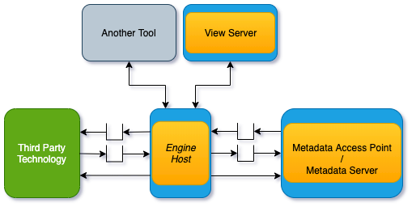

<!-- SPDX-License-Identifier: CC-BY-4.0 -->
<!-- Copyright Contributors to the ODPi Egeria project 2020. -->

# Governance Engine Hosting Servers

An **Engine Host** is an [OMAG Server](omag-server.md) that hosts one or more governance engines.
Governance engines provide collections of services used to support the governance of the digital
landscape and the metadata that describes it. 
The services within the governance engines may access third party technology to
perform their responsibilities or implement their behavior directly.
 
The engine host uses a metadata server to store the definitions of the governance
engines and the services within them.  These definitions are retrieved through the
[Governance Engine OMAS](../../../access-services/governance-engine).
The Governance Engine OMAS also manages the definition of 
[governance action processes](../../../access-services/governance-engine/docs/concepts/governance-action-process.md)
that choreograph calls to the services in a governance engine in order to implement
technical controls in the governance program.


> Figure 1: Engine Host in OMAG server ecosystem

Typically an engine host is deployed close to where the artifacts/resources/data are stored
because it can generate a lot of network traffic when its services are running.

The metadata interfaces needed by the governance engines are provided by the
[Open Metadata Engine Services (OMES)](../../../engine-services) (or engine services for short).
The engine services also run in the Engine Host OMAG Server.

The engine services are:

* **Asset Analysis** - For running [Open Discovery Services](../../../frameworks/open-discovery-framework/docs/discovery-service.md) 
                       that analyse the content of an asset's real world counterpart in the digital landscape, generates annotations
                       in an open discovery analysis report that is attached to the asset in the open metadata repositories.

* **Governance Action** - For running [Governance Action Services](../../../frameworks/governance-action-framework/docs/governance-action-service.md).
                        There are five types of governance action services:                
    * **Watchdog Governance Service** - Monitors changes in the open metadata repositories and initiates governance activity as a result.
        This is typically by creating a 
        [Governance Action](../../../frameworks/governance-action-framework/docs/governance-action.md), a 
        [Governance Action Process](../../../frameworks/governance-action-framework/docs/governance-action-process.md) or an
        [Incident Report](../../../frameworks/governance-action-framework/docs/incident-report.md).
        One example of a watchdog governance service is to monitor for the addition of a new asset.
  
    * **Verification Governance Service** - Runs checks on the metadata properties to ensure they are complete and correct.
   One example of a verification governance service is detection for metadata
   elements with the same qualified name, or an asset without an owner.
                      
    * **Triage Governance Service** - Runs triage tasks to determine how to manage an incident or situation.
    For example, it could initiate an external workflow, assign a task to a steward, wait for manual
    decision or initiate a remediation request.
                   
    * **Remediation Governance Service** - Makes updates to the open metadata or the digital landscape.
    An example of a remediation governance service could be to link or consolidate metadata elements with the same
   qualified name. Another remediation governance service may move assets between zones when a particular date is reached.
   
    * **Provisioning Governance Service** - Invokes a provisioning service whenever a provisioning request is made.  Typically the
   provisioning service is an external service.  It may also create lineage metadata to
   describe the work of the provisioning engine.                

An engine service is paired with a specific [access service](../../../access-services) running in either a 
[metadata access point](metadata-access-point.md) or a [metadata server](metadata-server.md).
The specific access services are:

* [Discovery Engine OMAS](../../../access-services/discovery-engine) for Asset Analysis OMES.
* [Governance Engine OMAS](../../../access-services/governance-engine) for Governance Engine OMES.

The name and URL root of the server where the access service is running
is needed to configure an engine service.

The metadata server used by the engine services does not need to be the same metadata server
as the one used by the engine host server.
This enables the management of metadata about the assets to be maintained close to the assets,
and the definitions of the governance engines, services and processes to be maintained
close to the governance team.  This separation is shown in Figure 2.


> Figure 2: Distribution of metadata managed by the engine host


The engine host services have an REST API to query the status of the governance engines
running in the engine services.  The engine services also have a REST API to query specific details of their
governance engines.  All of these REST APIs may be called by a view server as part of the
support for a user interface.


## Configuring the Engine Host Server


Each [type of OMAG Server](omag-server.md) is configured by creating
a [configuration document](configuration-document.md).  The contents
of the configuration document identify the type of server and
the options on the services it runs.

Figure 3 shows the structure of the configuration document for an engine host.


> Figure 3: Configuration Document for an Engine Host

The tasks for configuring an engine host are as follows.

* [Setting basic properties for an OMAG server](../user/configuring-omag-server-basic-properties.md)
* [Configuring the audit log destinations](../user/configuring-the-audit-log.md)
* [Configuring the server security connector](../user/configuring-the-server-security-connector.md)
* [Setting up the engine host services](../user/configuring-the-engine-host-services.md)

Below is an example of the configuration for a minimal engine host server.  It has
a single engine service (Asset Analysis OMES) and the default audit log.
Both the Governance Engine OMAS used by the engine host services and the Discovery Engine OMAS
used by the Asset Analysis OMES are running on the metadata server called `myMetadataServer`.

```json

{
    "class": "OMAGServerConfigResponse",
    "relatedHTTPCode": 200,
    "omagserverConfig": {
        "class": "OMAGServerConfig",
        "versionId": "V2.0",
        "localServerId": "8b745d03-5ffc-4978-81ab-bd3d5156eebe",
        "localServerName": "myserver",
        "localServerType": "Open Metadata and Governance Server",
        "localServerURL": "https://localhost:9443",
        "localServerUserId": "OMAGServer",
        "maxPageSize": 1000,
        "engineHostServicesConfig": {
            "omagserverPlatformRootURL": "https://localhost:9443",
            "omagserverName": "myMetadataServer",
            "engineServices": [
                {
                    "class": "EngineServiceConfig",
                    "engineId": 6000,
                    "engineQualifiedName": "Asset Analysis",
                    "engineServiceFullName": "Asset Analysis OMES",
                    "engineServiceURLMarker": "asset-analysis",
                    "engineServiceDescription": "Analyses the content of an asset's real world counterpart, generates annotations in an open discovery report that is attached to the asset in the open metadata repositories .",
                    "engineServiceWiki": "https://egeria.odpi.org/open-metadata-implementation/engine-services/asset-analysis/",
                    "engines" : [ {"engineId" : "daff1dca-984b-4b8a-8a8f-febaf72b82a8",
                                   "engineName" : "engine1", 
                                   "engineUserId" : "engine1UserId"},
                                  {"engineId" : "a80aa0f8-2ea0-4f84-b613-d68becba2693",
                                   "engineName" : "engine2", 
                                   "engineUserId" : "engine2UserId"} ],
                    "engineServiceOperationalStatus": "ENABLED",
                    "engineServiceAdminClass": "org.odpi.openmetadata.engineservices.assetanalysis.admin.AssetAnalysisAdmin",
                    "omagserverPlatformRootURL": "https://localhost:9443",
                    "omagserverName": "myMetadataServer"
                }
            ]},
        "repositoryServicesConfig": {
            "class": "RepositoryServicesConfig",
            "auditLogConnections": [
                {
                    "class": "Connection",
                    "headerVersion": 0,
                    "displayName": "Console",
                    "connectorType": {
                        "class": "ConnectorType",
                        "headerVersion": 0,
                        "type": {
                            "class": "ElementType",
                            "headerVersion": 0,
                            "elementOrigin": "LOCAL_COHORT",
                            "elementVersion": 0,
                            "elementTypeId": "954421eb-33a6-462d-a8ca-b5709a1bd0d4",
                            "elementTypeName": "ConnectorType",
                            "elementTypeVersion": 1,
                            "elementTypeDescription": "A set of properties describing a type of connector."
                        },
                        "guid": "4afac741-3dcc-4c60-a4ca-a6dede994e3f",
                        "qualifiedName": "Console Audit Log Store Connector",
                        "displayName": "Console Audit Log Store Connector",
                        "description": "Connector supports logging of audit log messages to stdout.",
                        "connectorProviderClassName": "org.odpi.openmetadata.adapters.repositoryservices.auditlogstore.console.ConsoleAuditLogStoreProvider"
                    },
                    "configurationProperties": {
                        "supportedSeverities": [
                            "<Unknown>",
                            "Information",
                            "Event",
                            "Decision",
                            "Action",
                            "Error",
                            "Exception",
                            "Security",
                            "Startup",
                            "Shutdown",
                            "Asset",
                            "Types",
                            "Cohort"
                        ]
                    }
                }
            ]
        },
        "auditTrail": [
            "Tue Dec 08 18:38:32 GMT 2020 me updated configuration for engine service asset-analysis.",
            "Tue Dec 08 18:43:47 GMT 2020 me set up default audit log destinations."
        ]
    }
}

```

## Further information

More information on the governance engines are available below:

* The capabilities of each of the engine
services are described in the [engine services](../../../engine-services) module.

* Details of how to create the definitions of the governance engines and governance services are 
  described in the [Governance Engine OMAS](../../../access-services/governance-engine) documentation.
 
 
----
Return to the [Governance Server Types](governance-server-types.md)

----
License: [CC BY 4.0](https://creativecommons.org/licenses/by/4.0/),
Copyright Contributors to the ODPi Egeria project.