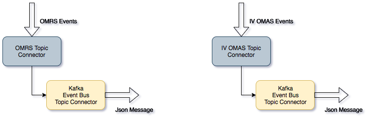

<!-- SPDX-License-Identifier: CC-BY-4.0 -->
<!-- Copyright Contributors to the ODPi Egeria project. -->

# Event Bus

The event bus is an infrastructure service that provides
the ability to reliably pass events between different servers.

There are many different implementations with greater or
lesser reliability and performance.
Many organizations establish a standard choice of their event
bus service.

Egeria uses [Apache Kafka](https://kafka.apache.org/)
as its default event bus implementation.
However, to allow other event bus implementations to
be plugged into the OMAG servers, all calls to the
event bus are issued through an
[event bus connector](../../../adapters/open-connectors/event-bus-connectors).

Details of the event bus connector is added to a server's configuration
document using the [Event Bus Config](../user/configuring-event-bus.md).
The event bus config establishes a set of defaults for the
event bus.  These defaults are then used whenever Egeria components
that use the event bus are configured.

Figure 1 shows the event bus in action.

> **Figure 1:** The event bus in use by OMAG servers and other technologies

It is hosting a number of topics.  Each topic manages the event exchange
for a particular collection of events.  For example, the
[OMRS Cohort Topic](../../../repository-services/docs/omrs-event-topic.md)
manages [repository services events](../../../repository-services/docs/event-descriptions).

The components using the event bus have a specialized connector that
supports event exchange for a specific collection of event.
Since it is necessary to be able to swap the event bus implementation,
These connectors embed a generic topic connector for the type of
event bus in use.  This is illustrated in Figure 2.

> **Figure 2:** Nested topic connectors

The configuration for these nested connectors is illustrated in
Figure 3.

> **Figure 3:** Embedded event bus configuration

1. The connector for the event bus topic is identified and
configured using the [Event Bus Config](../user/configuring-event-bus.md).

2. This configuration is encoded in a
[Connection object](../../../frameworks/open-connector-framework/docs/concepts/connection.md) for the
generic event bus topic connector.

3. When the consuming component is configured, a Connection object for
its specialized topic connector is created, with the generic event
bus topic connector embedded inside.

4. When the [Connector Broker](../../../frameworks/open-connector-framework/docs/concepts/connector-broker.md)
is called upon to create the specialized topic connector at server start up,
it navigates the hierarchy of Connection objects, creating the nested hierarchy of connectors
as specified.

----
License: [CC BY 4.0](https://creativecommons.org/licenses/by/4.0/),
Copyright Contributors to the ODPi Egeria project.