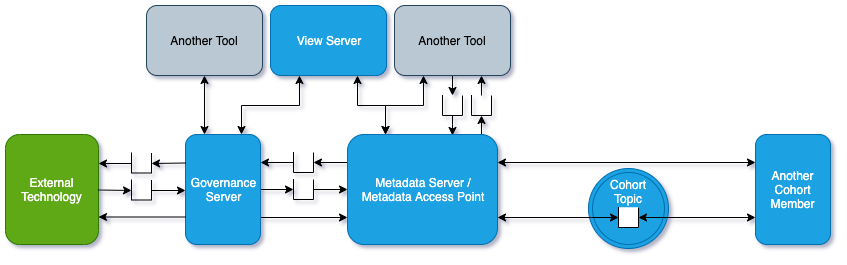

<!-- SPDX-License-Identifier: CC-BY-4.0 -->
<!-- Copyright Contributors to the ODPi Egeria project. -->

# Governance Servers

Governance servers host specific integration or
governance connectors for technology that does
not integrate directly with open metadata.

These are the different types:

* **[Engine Hosts](engine-host.md)**
   * **[Discovery Server](discovery-server.md)** - runs the discovery services to extract descriptive information from Assets and stores it in open metadata.
   * **[Stewardship Server](stewardship-server.md)** - automates the management of assets.

* **[Integration Daemons](integration-daemon.md)**
   * **[Data Engine Proxy](data-engine-proxy.md)** - captures information about processes and the data sources that they work with and catalogs them in open metadata.
   * **[Data Platform Server](data-platform-server.md)** - captures information about assets on a data platform and catalogs them in open metadata.
   * **[Security Sync Server](security-sync-server.md)** - automatically configures security verification endpoints such as Apache Ranger based on open metadata values.
   * **[Virtualizer](virtualizer.md)** - automatically configures a data virtualization engine based on the available assets.

* **[Open Lineage Server](open-lineage-server.md)** - accumulates lineage information to provide a comprehensive historical reporting service for lineage.

* **[Security Officer Server](security-officer-server.md)** - sets up security definitions.

Return to [OMAG Server](omag-server.md).

----
License: [CC BY 4.0](https://creativecommons.org/licenses/by/4.0/),
Copyright Contributors to the ODPi Egeria project.