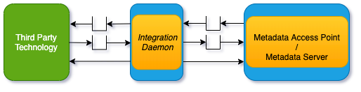
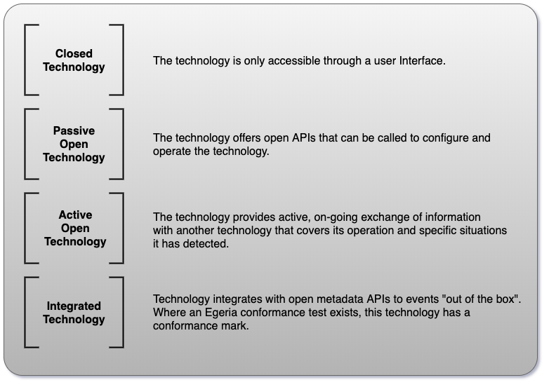
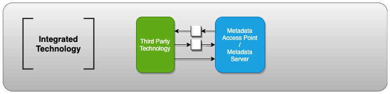
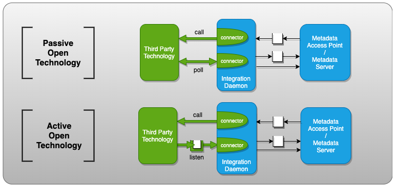

<!-- SPDX-License-Identifier: CC-BY-4.0 -->
<!-- Copyright Contributors to the ODPi Egeria project 2020. -->

# Integration Daemon

An **Integration Daemon** is an [OMAG Server](omag-server.md)
that provides metadata exchange services between third party
technology and the open metadata ecosystem.

The integration daemon interacts with the open metadata
ecosystem through [Open Metadata Access Services (OMAS)s](../../../access-services)
running in a [Metadata Access Point](metadata-access-point.md) or 
[Metadata Server](metadata-server.md).

> **Figure 1:** The integration daemon sitting between a third party technology and
> a metadata access point / metadata server

Inside the integration daemon are one or more **[Open Metadata Integration
Services (OMISs)](../../../integration-services)** that each focus on
metadata exchange with
a specific type of technology.  They are paired with a specific
[Open Metadata Access Service (OMAS)](../../../access-services)
running in the metadata access point / metadata server.

To understand how an integration daemon works, it is necessary to
look in a bit more detail at how technologies can be
connected together to exchange metadata.

Figure 2 show the four major mechanisms for
how a particular technology supports integration.

> **Figure 2:** Four types of integration capabilities that could be
> offered by a technology

Egeria does not provide any particular consideration for **Closed Technology**.
An **Integrated Technology** is able to interact directly with a
[Metadata Access Point](metadata-access-point.md) or
[Metadata Server](metadata-server.md), as shown in Figure 3.

> **Figure 3:** Integrated technology can call the open metadata services or
> consume the open metadata services directly

The **Integration Daemon** provides support for
the **Passive Open Technology** and the **Active Open Technology**.
This is shown in Figure 4.

> **Figure 4:** Using the integration daemon to integrate
> both passive and active open technology into the open metadata ecosystem

For **Passive Open Technology**, an integration service will
continuously poll the connector to allow it to repeatedly
call the technology's API to determine if
anything has changed and then pass any changes to the
metadata access point / metadata server.

The **Active Open Technology** support is similar except that
rather than polling for changes in the third party technology,
the connector listens on the third party
technology's event topic and translate the events it receives
and passes the information onto the access service via calls to
the integration service.

The integration service also
listens for events from its access service's 
[Out Topic](../../../access-services/docs/concepts/client-server/out-topic.md).
If there is new metadata that is of interest to the
third party technology, the access service publishes the
information and it is picked up by the integration service
and passed onto the connector.  The connector may then
push metadata to the third party technology.

Thus, the integration services of the integration daemon enable
metadata to flow both in and out of the open metadata ecosystem.

## Integration connectors

The code that manages the specific APIs and formats of the third party technology
is encapsulated in a special type of connector called an
**[integration connector](../../../governance-servers/integration-daemon-services/docs/integration-connector.md)**.

The specific interface that the integration connector needs to implement is defined by the
[integration service](../../../integration-services).
This interface enables the integration service to pass 
a context object to the connector before it is started.
The context enables the connector to
register a listener with the associated access service's
[Out Topic](../../../access-services/docs/concepts/client-server/out-topic.md), or call its REST API, or to
push events to the access service's 
[In Topic](../../../access-services/docs/concepts/client-server/in-topic.md).
By default the context uses the
integration daemon's userId for requests to the access service
which means that the metadata created by the integration connector
will be credited to this user.
If you want to use a different userId for metadata from each connector, 
the server's userId can be overridden in the connector's configuration.

## Configuring the Integration Daemon

The integration daemon is an [OMAG Server](omag-server.md) that runs on
the [OMAG Server Platform](omag-server-platform.md).
It is properties are defined in a [Configuration Document](configuration-document.md)
as shown in Figure 5:

> **Figure 5:** The configuration document contents for an integration daemon

The links below take you to the sections that describe the commands for each part of the configuration document:

* [Setting basic properties for the Integration Daemon](../user/configuring-omag-server-basic-properties.md)
* [Configuring the audit log destinations for log records from the Integration Daemon](../user/configuring-the-audit-log.md)
* [Configuring the server security connector for the Integration Daemon](../user/configuring-the-server-security-connector.md)
* [Configuring the Integration Services that run in the Integration Daemon](../user/configuring-the-integration-services.md)

Once it is configured, the integration daemon can be started using the
[Starting an OMAG Server](../user/starting-and-stopping-omag-server.md).

## Further Information

* For help in fixing any error you find using the integration daemon, visit the
[Integration Daemon Diagnostic Guide](../../../../open-metadata-publication/website/diagnostic-guide/integration-daemon-diagnostic-guide.md).
* Link to the [Egeria Solutions](../../../../open-metadata-publication/website/solutions) to see the integration
daemon in action.
* Link to the [Integration Daemon Services](../../../governance-servers/integration-daemon-services) to
understand how the integration daemon is implemented.

----
* Return to the [Governance Server](governance-server-types.md) types.
* Return to the [Admin Guide](../user).

----
License: [CC BY 4.0](https://creativecommons.org/licenses/by/4.0/),
Copyright Contributors to the ODPi Egeria project.