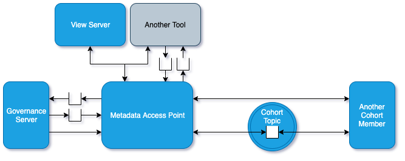

<!-- SPDX-License-Identifier: CC-BY-4.0 -->
<!-- Copyright Contributors to the ODPi Egeria project 2020. -->

# Metadata Access Point

A **Metadata Access Point** is an OMAG Server that can be a
[member of an open metadata repository cohort](cohort-member.md)
and supports the [access services](../../../access-services).

> Figure 1: Metadata Access Point in OMAG server ecosystem

This means it provides specialist metadata
APIs to user interfaces and governance servers that embrace metadata from
all connected open metadata repository cohorts.

## Configuring a Metadata Access Point

The tasks for configuring an metadata access point are as follows:

* [Setting up the default event bus](../user/configuring-event-bus.md)
* [Configuring the default local server URL root](../user/configuring-local-server-url.md)
* [Setting basic properties for an OMAG server](../user/configuring-omag-server-basic-properties.md)
* [Configuring the audit log destinations](../user/configuring-the-audit-log.md)
* [Configuring the server security connector](../user/configuring-the-server-security-connector.md)
* [Configuring registration to a cohort](../user/configuring-registration-to-a-cohort.md)
* [Configuring the Open Metadata Access Services (OMASs)](../user/configuring-the-access-services.md)

----
Return to [Cohort Members](cohort-member.md).

----
License: [CC BY 4.0](https://creativecommons.org/licenses/by/4.0/),
Copyright Contributors to the ODPi Egeria project.