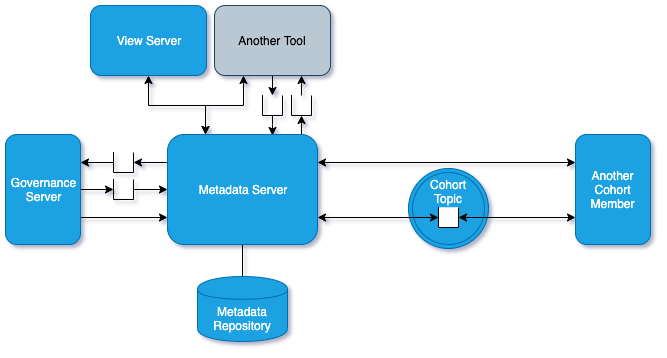
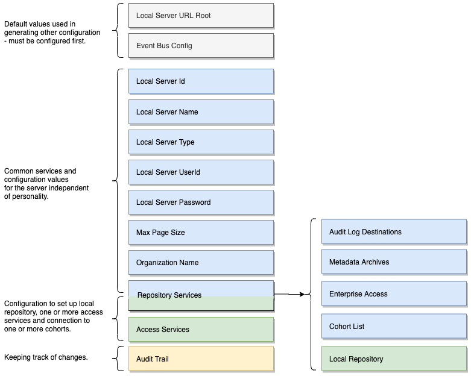

<!-- SPDX-License-Identifier: CC-BY-4.0 -->
<!-- Copyright Contributors to the ODPi Egeria project 2020. -->

# Metadata Server

A **Metadata Server** is an OMAG server that hosts a
metadata repository with native support for open metadata types and
instances.  It is able to be a 
[member of an open metadata repository cohort](cohort-member.md) and so
can exchange metadata with other members of the cohort.

> **Figure 1:** Metadata server in the open metadata ecosystem

The metadata server typically has the [access services](../../../access-services)
configured and so can act as a [metadata access point](metadata-access-point.md).
It is important to have at least one metadata server in each cohort in order to
support all types of metadata.

## Configuring a Metadata Server

Figure 2 shows the configuration document for a metadata server that does not connect to a cohort.

> **Figure 2:** Standalone metadata server

Figure 3 shows the metadata server configuration document with the cohort configuration added to
enable it to communicate with other metadata servers.

> **Figure 3:** Connected metadata server

The tasks for configuring an metadata server are as follows:

* [Setting up the default event bus](../user/configuring-event-bus.md)
* [Configuring the default local server URL root](../user/configuring-local-server-url.md)
* [Setting basic properties for an OMAG server](../user/configuring-omag-server-basic-properties.md)
* [Configuring the audit log destinations](../user/configuring-the-audit-log.md)
* [Configuring the server security connector](../user/configuring-the-server-security-connector.md)
* [Configuring the local repository](../user/configuring-the-local-repository.md)
* [Configuring registration to a cohort](../user/configuring-registration-to-a-cohort.md)
* [Configuring the open metadata archives loaded at server start](../user/configuring-the-startup-archives.md)
* [Configuring the Open Metadata Access Services (OMASs)](../user/configuring-the-access-services.md)

----
Return to [Cohort Members](cohort-member.md).

----
License: [CC BY 4.0](https://creativecommons.org/licenses/by/4.0/),
Copyright Contributors to the ODPi Egeria project.