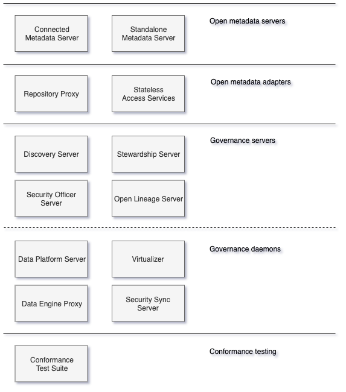

<!-- SPDX-License-Identifier: CC-BY-4.0 -->
<!-- Copyright Contributors to the ODPi Egeria project. -->

# OMAG Server Personalities

The OMAG server personalities represent standard configuration
patterns that produce specific types of [OMAG servers](omag-server.md).

Figure 1 lists the different OMAG server personalities.

> **Figure 1:** OMAG server personalities

The open metadata servers provide the Open Metadata Access Services (OMAS)
services and the 

Figure 2 shows these different personalities configured to work together.

## Further reading

These pages provide details of each OMAG Server Personality:

----
License: [CC BY 4.0](https://creativecommons.org/licenses/by/4.0/),
Copyright Contributors to the ODPi Egeria project.