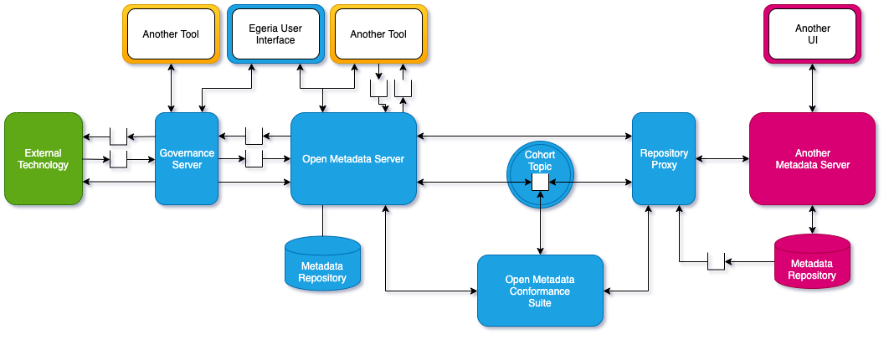

<!-- SPDX-License-Identifier: CC-BY-4.0 -->
<!-- Copyright Contributors to the ODPi Egeria project. -->

# OMAG Server Personalities

The OMAG server personalities represent standard Open Metadata and Governance (OMAG) server configuration
patterns that produce specific types of [OMAG servers](omag-server.md).

Figure 1 lists the different OMAG server personalities.

> **Figure 1:** OMAG server personalities

The **open metadata servers** support selected [Open Metadata Access Services (OMAS)](../../../access-services)
services and the [Open Metadata Repository Services (OMRS)](../../../repository-services) along with a metadata
repository to store metadata.

The **open metadata adapters** do not store metadata, but provide access to open metadata by connecting to an
[open metadata repository cohort](../../../repository-services/docs/open-metadata-repository-cohort.md).

The **governance servers** host specific integration and governance connectors to collect,
make use of and/or distribute open metadata to tools, engines and platforms.
The governance daemons are special governance servers that do not have an API but are driven solely by
changes in the metadata and the corresponding assets.

The **conformance test suite** is a specific configuration of an OMAG Server that tests the compliance of a 
metadata repository technology's integration into the open metadata ecosystem.

Figure 2 shows these different personalities configured to work together.

> **Figure 2:** OMAG server ecosystem

## Further reading

These pages provide more details of each OMAG Server Personality:

* [Repository Proxy](repository-proxy.md)
* [Governance Servers](../../../governance-servers/docs)

----
License: [CC BY 4.0](https://creativecommons.org/licenses/by/4.0/),
Copyright Contributors to the ODPi Egeria project.