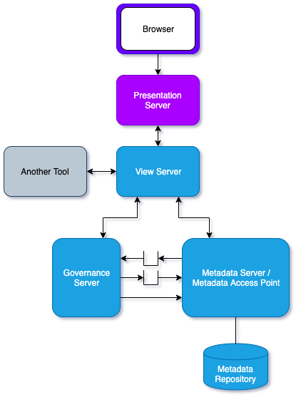

<!-- SPDX-License-Identifier: CC-BY-4.0 -->
<!-- Copyright Contributors to the ODPi Egeria project. -->

# Presentation Server

The **Presentation Server** hosts the JavaScript applications that provide an interactive browser-based
user interface for Egeria.
                            
The JavaScript applications call REST API services running in a [View Server](../concepts/view-server.md)
to retrieve information and perform operations relating to open metadata.

> **Figure 1:** A Presentation Server in the open metadata ecosystem

The presentation server supports multi-tenant operation.
Each presentation server tenant is designed to support an organization.
These may be independent organizations or divisions/departments within an organization.  

The tenant is configured with the appropriate view server to use, which in turn routes requests
to its governance servers and metadata servers.
Therefore each tenant sees a different collection of metadata and operates in isolation to the other tenants.

The set up and user guide for the presentation server is described here: 
[https://github.com/odpi/egeria-react-ui](https://github.com/odpi/egeria-react-ui).

----
* Learn about the [OMAG Server](omag-server.md) types.
* Return to the [Admin Guide](../user).

----
License: [CC BY 4.0](https://creativecommons.org/licenses/by/4.0/),
Copyright Contributors to the ODPi Egeria project.