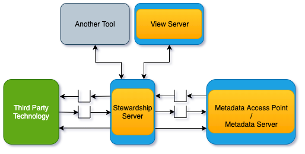

<!-- SPDX-License-Identifier: CC-BY-4.0 -->
<!-- Copyright Contributors to the ODPi Egeria project 2020. -->

# Stewardship Server

The **stewardship server** is an [OMAG Server](omag-server.md) that hosts one or more
stewardship engines.  These engines run **stewardship actions** which are services to

* Triage issues found in the open metadata ecosystem, or the assets it supports.
* Get approval (or not) for specific actions.
* Record decision made either by a person or automated process.
* Make changes to metadata and/or assets to fix an issue.

The stewardship engines are supported by the [Stewardship Action OMAS](../../../access-services/stewardship-action).

## Configuring the Stewardship Server

These are the steps to configure a stewardship server.   However this server is in development so although it
is possible to configure and start a stewardship server, it does not do anything once it is running.

* [Setting basic properties for an OMAG server](../user/configuring-omag-server-basic-properties.md)
* [Configuring the audit log destinations](../user/configuring-the-audit-log.md)
* [Configuring the server security connector](../user/configuring-the-server-security-connector.md)
* [Configuring the Stewardship Engine Services](../user/configuring-the-stewardship-engine-services.md)

----
License: [CC BY 4.0](https://creativecommons.org/licenses/by/4.0/),
Copyright Contributors to the ODPi Egeria project.