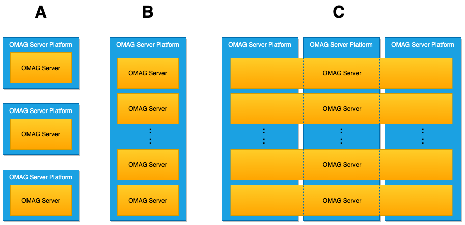

<!-- SPDX-License-Identifier: CC-BY-4.0 -->
<!-- Copyright Contributors to the ODPi Egeria project. -->

# Egeria Administration User Guide

The Egeria technology principally runs on the [Open Metadata and Governance (OMAG) Server Platform](../concepts/omag-server-platform.md).
This platform hosts one or more [OMAG Servers](../concepts/omag-server.md), 
each supporting a variety of open metadata and governance capabilities. 

In Figure 1, the OMAG Server Platforms are the blue rounded boxes and the 
orange circles are the OMAG Servers.


> **Figure 1:** OMAG Server Platforms running in different cloud platforms and/or data centers,
> each hosting OMAG Servers that are providing specialist integration capability
> for different tools.

This guide explains how the configure the OMAG Server Platform
and the different types of OMAG Servers that run on it.

If you are keen to get started right away then these are the links
to the configuration instructions.

* [Configuring the OMAG Server Platform](configuring-the-omag-server-platform.md)
* [Configuring an OMAG Server to run on an OMAG Server Platform](configuring-an-omag-server.md)
* [Configuring the Presentation Server (for UIs)](configuring-the-presentation-server.md)

and once you have your OMAG Servers configured:

* [Operating an OMAG Server](operating-omag-server.md)

What follows is more background on the administration services.

## OMAG Subsystems

An OMAG server is a set of configured [OMAG Subsystems](../concepts/omag-subsystem.md)
supported by the OMAG Server Platform.
Each subsystem supports a particular type of technology so it can exchange metadata with the
open metadata ecosystem.  Some technologies are sources of metadata, others just consume metadata
and then there are technologies that have a two-way exchange of metadata with the open metadata ecosystem.

The OMAG subsystems that are to be enabled in a specific instance of an OMAG Server
are defined in a **[configuration document](../concepts/configuration-document.md)**.
When the configuration document is loaded into the OMAG server platform, the OMAG server that it describes
is started, and the subsystems defined in the configuration document are activated for that server.

## OMAG Servers

In an open metadata landscape, it is anticipated that there may be multiple
instances of the OMAG Server running in an OMAG Server Platform, each performing a different role.
Each of these server instances would have their own configuration document allowing them
to have different subsystems active.

Figure 2 shows different choices for distributing OMAG Servers on the OMAG Platforms.


> **Figure 2:** OMAG Server deployment choices.  An OMAG Server may have multiple copies of the
> same type of OMAG Server on a platform (multi-tenant operation for a cloud service),
> or different types of OMAG Server on a platform, or a separate platform for each OMAG Server
>([more information](../concepts/omag-server.md)).

The choices are as follows:

* **A** - Each OMAG Server has its own dedicated OMAG Server Platform - useful when only one server is needed
in a deployment environment, or there is a desire to keep each server isolated in its own stack.

* **B** - Multiple OMAG Servers are hosted on the same OMAG Server Platform.  The OMAG Server Platform routes
inbound requests to the right server based on the server name specified in the request URL.
The servers may all be of the same type (multi-tenant operation) or be a set of collaborating servers
of different types consolidated on to the same platform.

* **C** - Multiple copies of same server instance running on different platforms to provide
high availability and distribution of workload (horizontal scalability).

## Configuring an OMAG Server

The configuration document for a specific OMAG server is identified by the server's name.
This is passed on the URL of every admin services API request along with the user
id of the administrator.  By default, the configuration is stored in a file called:

```
omag.server.{serverName}.config
```

The administration services that set up this file all begin with a URL like this:

```
.../open-metadata/admin-services/users/{adminUserId}/servers/{serverName}/...
```

The **serverName** specified on these calls determines which configuration
document is used, and hence which of the OMAG server's configuration it is working with.

The OMAG Server Platform typically starts up without any OMAG servers active.
Once it is running, it can be used to set up the configuration documents
that describe the open metadata subsystems needed for each OMAG server instance.

Once the configuration document is in place, the OMAG Server
can be activated and deactivated multiple times, across multiple
restarts of the OMAG Server Platform.

----
## Further information

* [Configuring the OMAG Server Platform](configuring-the-omag-server-platform.md)
* [Configuring an OMAG Server](configuring-an-omag-server.md)
* [Operating the OMAG Server](operating-omag-server.md)
* [Migrating OMAG Server Configuration Documents](migrating-configuration-documents.md)

## Examples of configuration calls

The admin-services modules has three [Postman](../../../../developer-resources/tools/Postman.md)
collections to illustrate many of the configuration and operation calls: 

* [Egeria-admin-services-platform-configuration.postman_environment.json](https://raw.githubusercontent.com/odpi/egeria/master/open-metadata-implementation/admin-services/Egeria-admin-services-platform-configuration.postman_collection.json) -
setting up and configuring the OMAG Server Platform.
* [Egeria-admin-services-server-configuration.postman_environment.json](https://raw.githubusercontent.com/odpi/egeria/master/open-metadata-implementation/admin-services/Egeria-admin-services-server-configuration.postman_collection.json) -
setting up and configuring the variety of OMAG Servers.
* [Egeria-admin-services-operational.postman_environment.json](https://raw.githubusercontent.com/odpi/egeria/master/open-metadata-implementation/admin-services/Egeria-admin-services-operational.postman_collection.json) -
operating the OMAG Servers.


----
Return to [main page](../../../../index.md)

----
License: [CC BY 4.0](https://creativecommons.org/licenses/by/4.0/),
Copyright Contributors to the ODPi Egeria project.
