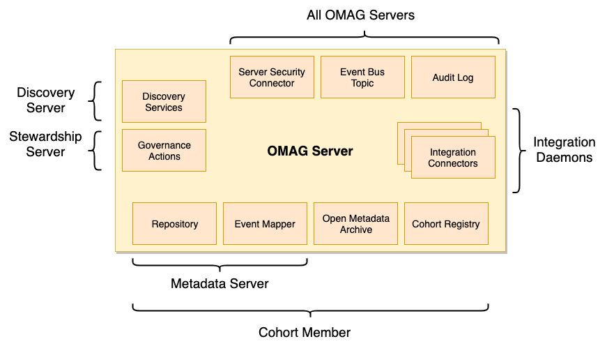

<!-- SPDX-License-Identifier: CC-BY-4.0 -->
<!-- Copyright Contributors to the ODPi Egeria project 2020. -->

# Configuring an OMAG Server

An [OMAG Server](../concepts/omag-server.md) is a configured set
of services and connectors that
support the integration of a particular type of technology.

There are different types of OMAG Server for each type of technology.
Each are configured separately and then linked together to form
a connected ecosystem.

Figure 1 shows the different types of OMAG Servers.  The hierarchy
in the diagram groups these servers according to their role in
the ecosystem.


> **Figure 1:** The different types of OMAG Servers organized into a hierarchy
> that shows the types of roles they perform and how they integrate together

The way to understand the diagram is that the arrows should be read as **IS A**.  For example,
the **Repository Proxy IS A Cohort Member** and the **Cohort Member IS A OMAG Server**.
This means that everything documented about a particular type of server is also true for
all server types that point to it through the **IS A** arrow, all of the way down the hierarchy.

Object-oriented software engineers would know of this type of relationship as behavior inheritance.

The [configuration document](../concepts/configuration-document.md)
for the OMAG Server determines which OMAG subsystems (and hence the types of open
metadata and governance services) that should be activated in the OMAG Server.
For example:

* Setting basic descriptive properties of the server that are used in logging and events
originating from the server.
* What type of local repository to use.
* Whether the Open Metadata Access Services (OMASs) should be started.
* Which cohorts to connect to.

Each of the configuration commands builds up sections in the configuration document.
This document is stored in the [configuration store](../concepts/configuration-document-store-connector.md) after each
configuration request so
it is immediately available for use each time the open metadata services are activated
in the OMAG Server.

Many of the configuration values are
[connections](../../../frameworks/open-connector-framework/docs/concepts/connection.md) to allow
the server to create the connectors to the resources it needs.

Figure 2 shows the different types of connectors and the OMAG Servers that use them.  The integration daemons
each have their own type of connectors and so they are shown as a group.


> **Figure 2:** the connector types supported by the OMAG Servers

These connectors enable Egeria to run in different container types, or deployment environments and
to connect to different third party technology.

In the descriptions of the configuration commands, there are placeholders
for the specific configuration values.  They are names of the value in double curly braces.
For example:

* {platformURLRoot} - The network address that the OMAG server platform is registered at - such as **https://localhost:9443**.
* {adminUserId} - The user id of the administrator, for example **garygeeke**.
* {serverName} - The name of the OMAG server, for example **cocoMDS1**.

Below are the linked to the 

### Common Configuration Tasks

* Configuration for all OMAG Servers
  * [Setting up the default event bus](configuring-event-bus.md)
  * [Configuring the default local server URL root](configuring-local-server-url.md)
  * [Setting basic properties for an OMAG server](configuring-omag-server-basic-properties.md)
  * [Configuring the audit log destinations](configuring-the-audit-log.md)
  * [Configuring the server security connector](configuring-the-server-security-connector.md)
   
* Specialist configuration for specific types of OMAG Servers
  * [Configuring the local repository](configuring-the-local-repository.md) - Metadata Server only
  * [Configuring registration to a cohort](configuring-registration-to-a-cohort.md) - Metadata Access Point, Metadata Server, Repository Proxy and Conformance Test Server only
  * [Configuring the open metadata archives loaded at server start](configuring-the-startup-archives.md) - Metadata Access Point, Metadata Server and Repository Proxy only
  * [Configuring the repository proxy connectors](configuring-the-repository-proxy-connector.md) - Repository Proxy only
  * [Configuring the Open Metadata Access Services (OMASs)](configuring-the-access-services.md) - Metadata Access Point and Metadata Server only
  * [Configuring the Open Metadata Engine Services (OMES)](configuring-the-engine-services.md) - Engine Host only
  * [Configuring the Open Metadata Integration Services (OMIS)](configuring-the-integration-services.md) - Integration Daemon only
  * [Configuring the Open Metadata View Services (OMVSs)](configuring-the-view-services.md) - View Server only

### Advanced Configuration Topics

* [Migrating configuration documents](migrating-configuration-documents.md)


## Querying the contents of a configuration document

It is possible to query the configuration document for a specific OMAG server using the following command.

```
GET {platformURLRoot}/open-metadata/admin-services/users/{adminUserId}/servers/{serverName}/configuration
```

It is also possible to query the origin of the server supporting the open metadata services.
For the Egeria OMAG Server Platform, the response is "Egeria OMAG Server Platform (version 2.10-SNAPSHOT)".

```
GET {platformURLRoot}/open-metadata/platform-services/users/{adminUserId}/servers/{serverName}/server-platform-origin
```


----
Return to the [Administration Guide Overview](.)


----
License: [CC BY 4.0](https://creativecommons.org/licenses/by/4.0/),
Copyright Contributors to the ODPi Egeria project.
