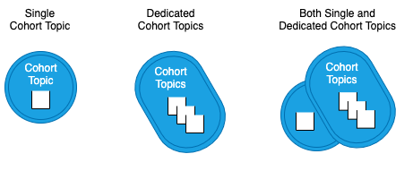
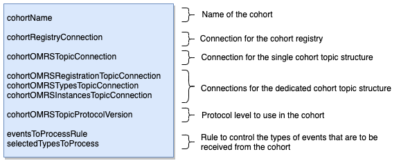

<!-- SPDX-License-Identifier: CC-BY-4.0 -->
<!-- Copyright Contributors to the ODPi Egeria project. -->


# Configuring Registration to an Open Metadata Repository Cohort

An [OMAG Server](../concepts/omag-server.md) that is capable of being a
[Cohort Member](../concepts/cohort-member.md) can register with one or more
open metadata repository cohorts.  

Each cohort has a memorable name - eg `cocoCohort`.  This name needs to be used in the
configuration of each member.
At the heart of a cohort are 1-4 cohort topics.
These are topics on an [event bus](../concepts/event-bus.md) that the members use to exchange information.

There is a choice of topic structure for the cohort.

* A single topic is used for all types of events
* Three topics are used, each dedicated to a specific type of cohort event:
   * Registration events that exchange information about the members of the cohort.
   * Type verification events that ensure consistency of the open metadata types used by the
     members of the cohort.
   * Instance events that enable members of the cohort to share metadata elements.
   
The use of a single topic comes from the original implementation of Egeria.
The use of the three dedicated topics was added later in version 2.11
to reduce the latency of cohort registration
and to allow tuning of each topic's configuration.
This is essential when multiple instances of an OMAG server are running in a cluster
because the registration and type verification events need to be received by all server instances and the
instance events need only to be received by one of the server instances.

Typically all members of the cohort should be configured to use the same topic structure.
However, if one of the members is back level and can only support the single topic then the
other members can be set up to operate both topic structures.  This is less efficient as these servers
will process most instance events twice.  However it does provide a workaround until the back-level
member can be upgraded.

The choices of topic structure are summarized in Figure 1.


> **Figure 1:** Choices of cohort topic structures referred to as SINGLE_TOPIC, DEDICATED_TOPICS and BOTH_SINGLE_AND_DEDICATED_TOPICS reading left to right

## Configuration commands

The commands for configuring a server as a member of a cohort are shown below.
Before calling these commands, make sure that the [default settings for the event bus](configuring-event-bus.md)
are configured and you know the name of the cohort and the topic structure it is using.

### Add access to a cohort

The following command registers the server with a cohort using the default settings.
This includes the default cohort topic structure
which is SINGLE_TOPIC before version 3.0 and DEDICATED_TOPICS for version 3.0 and above.

```
POST {platformURLRoot}/open-metadata/admin-services/users/{adminUserId}/servers/{serverName}/cohorts/{cohortName}
```

Alternatively it is possible to explicitly specify the cohort topic structure. The example below
sets it to DEDICATED_TOPICS.  The other options are SINGLE_TOPIC and BOTH_SINGLE_AND_DEDICATED_TOPICS.

```
POST {platformURLRoot}/open-metadata/admin-services/users/{adminUserId}/servers/{serverName}/cohorts/{cohortName}/topic-structure/DEDICATED_TOPICS
```

Both of these commands optionally support passing a map of name-value pairs in the request body.
These properties are added to the `additionalProperties`
attribute of the Connection objects for each of the cohort topics.
The additional properties supported are specific to the topic connector implementation.
For example, [see the Apache Kafka Topic Connector Documentation](../../../adapters/open-connectors/event-bus-connectors/open-metadata-topic-connectors/kafka-open-metadata-topic-connector).

The result of the cohort configuration call fills out an entry in the cohort list of the server's [configuration document](../concepts/configuration-document.md).
The fields in a cohort list entry are show in Figure 2.



> **Figure 2:** Fields in an entry in a server's cohort list

It is possible to update any of these fields directly using the following command:

```
POST {platformURLRoot}/open-metadata/admin-services/users/{adminUserId}/servers/{serverName}/cohorts/{cohortName}/configuration
```
Where the complete cohort entry structure is passed as the request body.
Below is an example of this structure for a member that is using DEDICATED_TOPICS.

```json
{
    "class": "CohortConfig",
    "cohortName": "cocoCohort",
    "cohortRegistryConnection": {
        "class": "Connection",
        "headerVersion": 0,
        "connectorType": {
            "class": "ConnectorType",
            "headerVersion": 0,
            "type": {
                "class": "ElementType",
                "headerVersion": 0,
                "elementOrigin": "LOCAL_COHORT",
                "elementVersion": 0,
                "elementTypeId": "954421eb-33a6-462d-a8ca-b5709a1bd0d4",
                "elementTypeName": "ConnectorType",
                "elementTypeVersion": 1,
                "elementTypeDescription": "A set of properties describing a type of connector."
            },
            "guid": "108b85fe-d7a8-45c3-9f88-742ac4e4fd14",
            "qualifiedName": "File Based Cohort Registry Store Connector",
            "displayName": "File Based Cohort Registry Store Connector",
            "description": "Connector supports storing of the open metadata cohort registry in a file.",
            "connectorProviderClassName": "org.odpi.openmetadata.adapters.repositoryservices.cohortregistrystore.file.FileBasedRegistryStoreProvider"
        },
        "endpoint": {
            "class": "Endpoint",
            "headerVersion": 0,
            "address": "./data/servers/cocoMDS4/cohorts/cocoCohort.registrystore"
        }
    },
    "cohortOMRSRegistrationTopicConnection": {
        "class": "VirtualConnection",
        "headerVersion": 0,
        "connectorType": {
            "class": "ConnectorType",
            "headerVersion": 0,
            "connectorProviderClassName": "org.odpi.openmetadata.repositoryservices.connectors.omrstopic.OMRSTopicProvider"
        },
        "embeddedConnections": [
            {
                "class": "EmbeddedConnection",
                "headerVersion": 0,
                "position": 0,
                "displayName": "cocoCohort OMRS Topic for registrations",
                "embeddedConnection": {
                    "class": "Connection",
                    "headerVersion": 0,
                    "connectorType": {
                        "class": "ConnectorType",
                        "headerVersion": 0,
                        "type": {
                            "class": "ElementType",
                            "headerVersion": 0,
                            "elementOrigin": "LOCAL_COHORT",
                            "elementVersion": 0,
                            "elementTypeId": "954421eb-33a6-462d-a8ca-b5709a1bd0d4",
                            "elementTypeName": "ConnectorType",
                            "elementTypeVersion": 1,
                            "elementTypeDescription": "A set of properties describing a type of connector."
                        },
                        "guid": "3851e8d0-e343-400c-82cb-3918fed81da6",
                        "qualifiedName": "Kafka Open Metadata Topic Connector",
                        "displayName": "Kafka Open Metadata Topic Connector",
                        "description": "Kafka Open Metadata Topic Connector supports string based events over an Apache Kafka event bus.",
                        "connectorProviderClassName": "org.odpi.openmetadata.adapters.eventbus.topic.kafka.KafkaOpenMetadataTopicProvider",
                        "recognizedConfigurationProperties": [
                            "producer",
                            "consumer",
                            "local.server.id",
                            "sleepTime"
                        ]
                    },
                    "endpoint": {
                        "class": "Endpoint",
                        "headerVersion": 0,
                        "address": "egeria.omag.openmetadata.repositoryservices.cohort.cocoCohort.OMRSTopic.registration"
                    },
                    "configurationProperties": {
                        "producer": {
                            "bootstrap.servers": "localhost:9092"
                        },
                        "local.server.id": "73955db6-026c-4ba5-a180-1355dbf166cf",
                        "consumer": {
                            "bootstrap.servers": "localhost:9092"
                        }
                    }
                }
            }
        ]
    },
    "cohortOMRSTypesTopicConnection": {
        "class": "VirtualConnection",
        "headerVersion": 0,
        "connectorType": {
            "class": "ConnectorType",
            "headerVersion": 0,
            "connectorProviderClassName": "org.odpi.openmetadata.repositoryservices.connectors.omrstopic.OMRSTopicProvider"
        },
        "embeddedConnections": [
            {
                "class": "EmbeddedConnection",
                "headerVersion": 0,
                "position": 0,
                "displayName": "cocoCohort OMRS Topic for types",
                "embeddedConnection": {
                    "class": "Connection",
                    "headerVersion": 0,
                    "connectorType": {
                        "class": "ConnectorType",
                        "headerVersion": 0,
                        "type": {
                            "class": "ElementType",
                            "headerVersion": 0,
                            "elementOrigin": "LOCAL_COHORT",
                            "elementVersion": 0,
                            "elementTypeId": "954421eb-33a6-462d-a8ca-b5709a1bd0d4",
                            "elementTypeName": "ConnectorType",
                            "elementTypeVersion": 1,
                            "elementTypeDescription": "A set of properties describing a type of connector."
                        },
                        "guid": "3851e8d0-e343-400c-82cb-3918fed81da6",
                        "qualifiedName": "Kafka Open Metadata Topic Connector",
                        "displayName": "Kafka Open Metadata Topic Connector",
                        "description": "Kafka Open Metadata Topic Connector supports string based events over an Apache Kafka event bus.",
                        "connectorProviderClassName": "org.odpi.openmetadata.adapters.eventbus.topic.kafka.KafkaOpenMetadataTopicProvider",
                        "recognizedConfigurationProperties": [
                            "producer",
                            "consumer",
                            "local.server.id",
                            "sleepTime"
                        ]
                    },
                    "endpoint": {
                        "class": "Endpoint",
                        "headerVersion": 0,
                        "address": "egeria.omag.openmetadata.repositoryservices.cohort.cocoCohort.OMRSTopic.types"
                    },
                    "configurationProperties": {
                        "producer": {
                            "bootstrap.servers": "localhost:9092"
                        },
                        "local.server.id": "73955db6-026c-4ba5-a180-1355dbf166cf",
                        "consumer": {
                            "bootstrap.servers": "localhost:9092"
                        }
                    }
                }
            }
        ]
    },
    "cohortOMRSInstancesTopicConnection": {
        "class": "VirtualConnection",
        "headerVersion": 0,
        "connectorType": {
            "class": "ConnectorType",
            "headerVersion": 0,
            "connectorProviderClassName": "org.odpi.openmetadata.repositoryservices.connectors.omrstopic.OMRSTopicProvider"
        },
        "embeddedConnections": [
            {
                "class": "EmbeddedConnection",
                "headerVersion": 0,
                "position": 0,
                "displayName": "cocoCohort OMRS Topic for instances",
                "embeddedConnection": {
                    "class": "Connection",
                    "headerVersion": 0,
                    "connectorType": {
                        "class": "ConnectorType",
                        "headerVersion": 0,
                        "type": {
                            "class": "ElementType",
                            "headerVersion": 0,
                            "elementOrigin": "LOCAL_COHORT",
                            "elementVersion": 0,
                            "elementTypeId": "954421eb-33a6-462d-a8ca-b5709a1bd0d4",
                            "elementTypeName": "ConnectorType",
                            "elementTypeVersion": 1,
                            "elementTypeDescription": "A set of properties describing a type of connector."
                        },
                        "guid": "3851e8d0-e343-400c-82cb-3918fed81da6",
                        "qualifiedName": "Kafka Open Metadata Topic Connector",
                        "displayName": "Kafka Open Metadata Topic Connector",
                        "description": "Kafka Open Metadata Topic Connector supports string based events over an Apache Kafka event bus.",
                        "connectorProviderClassName": "org.odpi.openmetadata.adapters.eventbus.topic.kafka.KafkaOpenMetadataTopicProvider",
                        "recognizedConfigurationProperties": [
                            "producer",
                            "consumer",
                            "local.server.id",
                            "sleepTime"
                        ]
                    },
                    "endpoint": {
                        "class": "Endpoint",
                        "headerVersion": 0,
                        "address": "egeria.omag.openmetadata.repositoryservices.cohort.cocoCohort.OMRSTopic.instances"
                    },
                    "configurationProperties": {
                        "producer": {
                            "bootstrap.servers": "localhost:9092"
                        },
                        "local.server.id": "73955db6-026c-4ba5-a180-1355dbf166cf",
                        "consumer": {
                            "bootstrap.servers": "localhost:9092"
                        }
                    }
                }
            }
        ]
    },
    "cohortOMRSTopicProtocolVersion": "V1",
    "eventsToProcessRule": "ALL"
}
```

### Controlling the name of the cohort topic(s)

Typically a production deployment of an event bus requires the topics to be explicitly defined in its
configuration.  In addition, many organizations have naming standards for topics.
Therefore Egeria provides commands to query the topic names from the
configuration for easy automation and the ability to override the topic names.

The default single topic name is `egeria.omag.openmetadata.repositoryservices.cohort.{cohortName}.OMRSTopic`
and the default dedicated topic names are:

* For registration events - `egeria.omag.openmetadata.repositoryservices.cohort.{cohortName}.OMRSTopic.registration`
* For type verification events - `egeria.omag.openmetadata.repositoryservices.cohort.{cohortName}.OMRSTopic.types`
* For instance events - `egeria.omag.openmetadata.repositoryservices.cohort.{cohortName}.OMRSTopic.instances`

This is the command to query the single topic name.
```
GET {platformURLRoot}/open-metadata/admin-services/users/{adminUserId}/servers/{serverName}/cohorts/{cohortName}/topic-name
```
This is an example of the result for a configured cohort that is using the single topic:
```json
{
    "class": "StringResponse",
    "relatedHTTPCode": 200,
    "resultString": "egeria.openmetadata.repositoryservices.cohort.cocoCohort.OMRSTopic"
}
```
If the server is using the DEDICATED_TOPICS, the result looks like this because the single topic connector is not specified:
```json
{
    "class": "StringResponse",
    "relatedHTTPCode": 200
}
```
If the cohort name is not known, the result looks like this:
```json
{
    "class": "StringResponse",
    "relatedHTTPCode": 400,
    "exceptionClassName": "org.odpi.openmetadata.adminservices.ffdc.exception.OMAGInvalidParameterException",
    "exceptionErrorMessage": "OMAG-ADMIN-400-033 The OMAG server cocoMDS1 is unable to override the cohort topic until the cocoCohortXXX cohort is set up",
    "exceptionSystemAction": "No change has occurred in this server's configuration document.",
    "exceptionUserAction": "Add the cohort configuration using the administration services and retry the request."
}
```

This is the command to retrieve the dedicated topics:

```
GET {platformURLRoot}/open-metadata/admin-services/users/{adminUserId}/servers/{serverName}/cohorts/{cohortName}/dedicated-topic-names
```

The result looks like this with the registration topic showing first, then the type verification topic and lastly the instances topic:

```json
{
    "class": "NameListResponse",
    "relatedHTTPCode": 200,
    "names": [
        "egeria.omag.openmetadata.repositoryservices.cohort.cocoCohort.OMRSTopic.registration",
        "egeria.omag.openmetadata.repositoryservices.cohort.cocoCohort.OMRSTopic.types",
        "egeria.omag.openmetadata.repositoryservices.cohort.cocoCohort.OMRSTopic.instances"
    ]
}
```

### Override the value for the cohort topic

It is also possible to change the name of the topics used by a cohort.
Any changes must be issued against each member of the cohort so that they are
all connecting to the same cohort topic(s).
The new value takes affect the next time the server is started.

 
Changing the single topic name is done with the following command
```
POST {platformURLRoot}/open-metadata/admin-services/users/{adminUserId}/servers/{serverName}/cohorts/{cohortName}/topic-name-override
{newTopicName}
```

The `{newTopicName}` flows in the request body as raw text.

This is the command for changing the registration topic name:

```
POST {platformURLRoot}/open-metadata/admin-services/users/{adminUserId}/servers/{serverName}/cohorts/{cohortName}/topic-name-override/registration
{newTopicName}
```

This is the command for changing the type verification topic name:

```
POST {platformURLRoot}/open-metadata/admin-services/users/{adminUserId}/servers/{serverName}/cohorts/{cohortName}/topic-name-override/types
{newTopicName}
```

This is the command for changing the instances topic name:

```
POST {platformURLRoot}/open-metadata/admin-services/users/{adminUserId}/servers/{serverName}/cohorts/{cohortName}/topic-name-override/instances
{newTopicName}
```

### Disconnect from a cohort

This command unregisters a server from a cohort.

```
DELETE {platformURLRoot}/open-metadata/admin-services/users/{adminUserId}/servers/{serverName}/cohorts/{cohortName}
```


----
* Return to [Configuring an OMAG Server](configuring-an-omag-server.md)
* Return to [Configuring a Metadata Access Point](../concepts/metadata-access-point.md#Configuring-a-Metadata-Access-Point)
* Return to [Configuring a Metadata Server](../concepts/metadata-server.md#Configuring-a-Metadata-Server)
* Return to [Configuring a Repository Proxy](../concepts/repository-proxy.md#Configuring-a-Repository-Proxy)
* Return to [Configuring a Conformance Test Server](../concepts/conformance-test-server.md#Configuring-a-Conformance-Test-Server)
* Return to [configuration document structure](../concepts/configuration-document.md)

----
License: [CC BY 4.0](https://creativecommons.org/licenses/by/4.0/),
Copyright Contributors to the ODPi Egeria project.