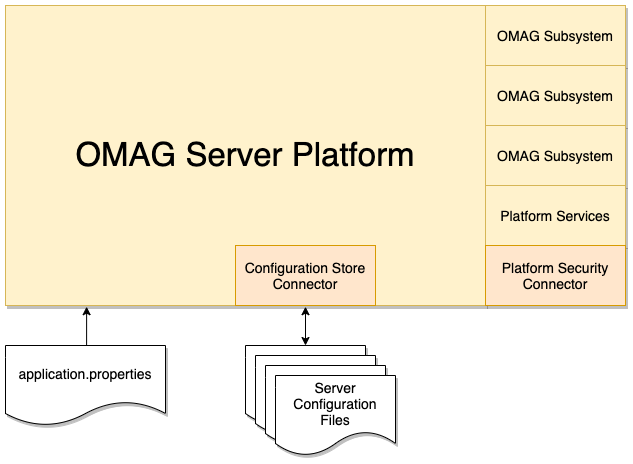

<!-- SPDX-License-Identifier: CC-BY-4.0 -->
<!-- Copyright Contributors to the ODPi Egeria project 2020. -->

# Configuring the OMAG Server Platform

The **OMAG Server Platform** is a JVM process that includes a tomcat
web server and uses [Spring Boot](https://spring.io/) to support REST APIs.

By default
* It registers the REST APIs at **https://localhost:9443**. 
This address is called the platform's **[URL root](../concepts/platform-url-root.md)**
and is configured in a number of places in the [OMAG Server](configuring-an-omag-server.md) configuration.

* The platform supports no specific security authorization.

* All configuration is stored in encrypted files - one for each [OMAG Server](../concepts/omag-server.md)
  configured to run on it.

These defaults are suitable for a development environment. However for
production, the platform should be configured with platform security because this ensures configuration
is managed by authorized users.

Figure 1 shows the points of configuration for the OMAG Server Platform.

> **Figure 1:** What needs to be configured in the server platform

The choices are:

* [Configuring the Configuration Connector](configuring-the-configuration-document-store.md) -
to change the storage location and format of OMAG Server configuration documents.
  
* [Configuring the Platform Security Connector](configuring-the-platform-security-connector.md) -
to change who is allowed to call the platform services.

## Application Properties

Since the OMAG Server Platform is a Spring Boot application, there are other values that can be set in
its **application.properties** file found in the **resources** subdirectory.

* Defining the port that the OMAG Server Platform will listen on for
  REST API calls.
  
* Controlling the level of developer logging that the platform
  produces when it is running. See [Configuring logging options](omag-server-platform-logging.md) for more details.
  
* Defining where the connector implementations should be loaded from.

Follow [this link for more information](https://docs.spring.io/spring-boot/docs/current/reference/html/appendix-application-properties.html)
on standard properties.
In addition, Egeria adds support for additional application properties.

* [Auto-starting servers](configuring-the-server-startup-list-for-the-platform.md) - Defining which OMAG Servers, 
  if any, should be started automatically by the OMAG Server Platform when it starts.

## Transport Level Security (TLS)

Transport level security describes the security applied to API calls made between servers.
The most commonly known transport level security is SSL.

See [Transport Level Security in Egeria and Certificates](omag-server-platform-transport-level-security.md) for
information on setting up transport level security in the OMAG Server Platform.

----
Return to the [Administration Services User Guide](.)

----
License: [CC BY 4.0](https://creativecommons.org/licenses/by/4.0/),
Copyright Contributors to the ODPi Egeria project.
