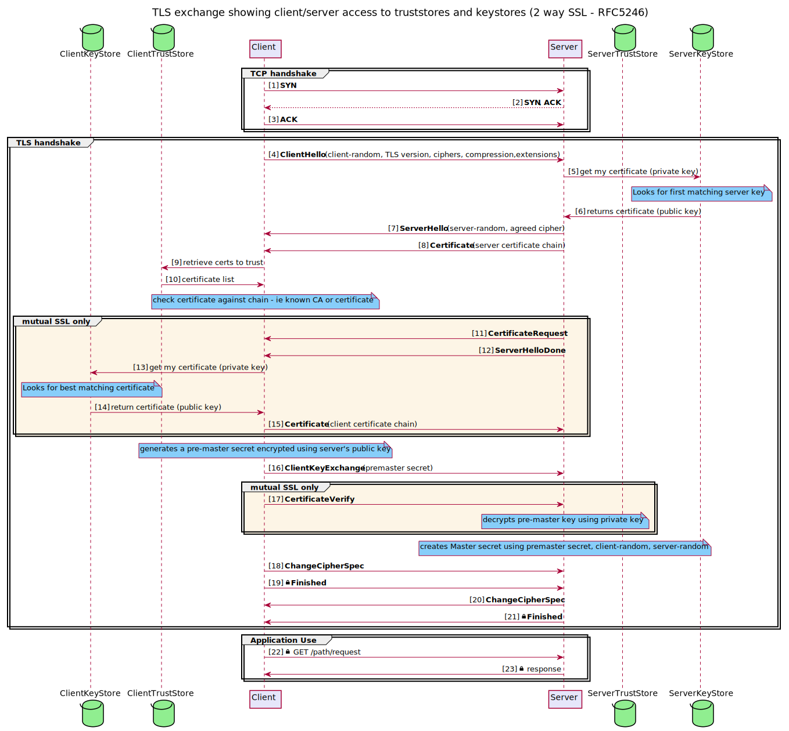

<!-- SPDX-License-Identifier: CC-BY-4.0 -->
<!-- Copyright Contributors to the Egeria project. -->

# Transport Level Security (TLS) and Certificates

Egeria uses TLS with certificates to secure the communication to and from the
[OMAG Server Platforms](../concepts/omag-server-platform.md).

In this document you'll find information on:
 * A background to TLS
 * Using TLS with the OMAG Server Platform
 * Using TLS with Egeria's Java clients (also used in the OMAG Server Platform)
 * Using TLS with other types of clients (third party tools and applications)

## TLS protocol

Transport Level Security (TLS) protects communications over network connections through Encryption,
Authentication and Integrity.  It is just one layer of security of many.

### One-way SSL exchange

One-way SSL exchange is typically in use when browsing the web - since as a user
you are most concerned that the server you are connecting to is authentic.

With this approach, the server is not able to guarantee your authenticity at the transport level.
This means you can
be assured of the identity of the server, but it can not be sure of who you are.

[Transport Level Security(Wikipedia)](https://en.wikipedia.org/wiki/Transport_Layer_Security)

### Two-way (mutual) SSL exchange

With two-way (mutual) SSL exchange, trust is established both ways.
This is more typical when interconnecting different systems
and applications which are known in advance. 

[Mutual Authentication(Wikipedia)](https://en.wikipedia.org/wiki/Mutual_authentication)

## Certificates for the OMAG Server Platform

Egeria's OMAG Server Platform is a Spring boot based application.
We refer to it as Egeria's 'platform', which hosts Egeria [OMAG Servers](../concepts/omag-server.md).

However in the documentation relating to network communications and SSL,
a "server" is usually seen as an application listening on a network port.
For Egeria, this 'server' would be the OMAG Server Platform.
It is important to be aware of this terminology difference when
reading the links and references mentioned here.

An instance of the OMAG Server Platform services requests over a REST based API 
from other OMAG Server Platforms, UIs, tools and engines.
In this regard it's role in SSL network requests described above is that of a 
**network server**, with its callers performing the role of a **network client**.

However since the OMAG Server Platform also makes requests to other systems
(including other OMAG Server Platforms and Apache Kafka)
it is also fulfilling a **network client** role.

As a spring application, the OMAG Server Platform's configuration for it's network server role allows the following spring properties
to be set:

* `server.ssl-key-store`                Used by tomcat/spring boot to locate keys that identify the server
* `server.ssl-key-alias`                Used by tomcat/spring boot to identify the alias of the key tomcat should use for itself
* `server.ssl.key-store-password`       Used by tomcat/spring boot for the keystore password (2 way SSL)
* `server.ssl.trust-store`              Used by tomcat/spring boot to understand what clients it can trust (2 way SSL)
* `server.ssl.trust-store-password`     Used by tomcat/spring boot  for the password of the truststore (2 way SSL)

In addition an additional parameter is provided which causes ssl verification to be skipped:

* `strict.ssl`                          true / false : If set to true skips checks on certificate

For further details on these and other less common configuration options, refer to the Spring Docs

Since the OMAG Server Platform is also a network client the settings in the next section for 
clients are also required.

## Egeria Java Clients

Standard java properties need to be set within the JVM running the Egeria client code (this includes the OMAG Server Platform):

* `javax.net.ssl.keyStore`                keyStore for client to use (2 way SSL needs this)
* `javax.net.ssl.keyStorePassword`        password for the keystore  (2 way SSL needs this)
* `javax.net.ssl.trustStore`              trustStore for the client to use (always needs setting as egeria makes client calls)
* `javax.net.ssl.trustStorePassword`      password for the truststore (always - as above)

In addition, for any executable jars provided by Egeria - such as samples, an additional
parameter will cause ssl verification to be skipped. This is only recommended for test
and development

* `strict.ssl`                            true / false : If set to true skips checks on certificate

Note that in the case of Java Clients, these are system properties, and do
not use spring conventions. 

## Other clients

Similar principles to those documented for java should apply. If you need further assistance please
contact the team on our slack channel at http://slack.lfai.foundation . A Pull Request (or issue) with contributed documentation
is very welcome !

## Example script to launch Egeria

Example certificates are provided [here](../../../../open-metadata-resources/open-metadata-deployment/certificates) 

As an example of running the Egeria server chassis with the certificates generated above, add
the following options when launching the OMAG Server Platform jar file:

 * -Dserver.ssl.key-store=${KS} 
 * -Dserver.ssl.key-alias=EgeriaServerChassis
 * -Dserver.ssl.key-store-password=egeria
 * -Dserver.ssl.trust-store=EgeriaCA.p12
 * -Dserver.ssl.trust-store-password=egeria
 * -Djavax.net.ssl.keyStore=EgeriaServerChassis 
 * -Djavax.net.ssl.keyStorePassword=egeria
 * -Djavax.net.ssl.trustStore=EgeriaCA.p12
 * -Djavax.net.ssl.trustStorePassword=egeria 
  
We have to use both server.ssl and javax.net values since the former controls how the OMAG Server Platform
works when accepting inbound connections and the latter are needed
when it acts as a network client.

We have assumed the default keystore passwords, and also that we will use the same key regardless of whether it is the one
that the chassis sends back to it's client after they connect, or the one the chassis may send to those other repositories. They
could be distinct if needed.

## Creating your own certificates

The example certificates are fine for development.
However it is important to have your own certificates for a production environment.

Example configurations and scripts can be found in [open-metadata-resources/open-metadata-deployment/certificates](../../../../open-metadata-resources/open-metadata-deployment/certificates)

An example script (MacOS/Linux)to create certificates is provided in `gensamplecerts.sh`. It is intended only as an example.
It requires the `openssl` tool and `keytool`. Deployment frameworks in cloud services may also offer support to
generate certificates and it's likely an enterprise process will be place in larger organizations.

The script creates a Certificate Authority and then specific certificates for different Egeria components.
It could be extended to create certificates for other clients especially if using 2 way SSL.

When the script is run it also makes use of the configuration template `openssl.cnf.`

Together both set some important characteristics that are needed to allow the certificate to work properly
especially with current browsers
 - ensuring basicConstraints are specified
 - ensuring the certificate expiry time is not too far in the future
 - ensuring subjectAltName is specified.

### Additional Notes
 
#### Building diagrams

Note: Rendered image files are checked in, however when updating, the diagrams can be regenerated using 
 
For example: 
`plantuml -svg ssl-oneway.puml` 

The diagrams are best rendered to svg, however notes do not render with a background if using the IntelliJ markdown plugin.
They do render correctly if opened directly in IntelliJ, as well as in a browser

It's also recommended to install the IntelliJ 'PlantUML' plugin to get a real-time preview whilst updating the diagrams.

----
* Return to [Configuring an OMAG Server Platform](configuring-the-omag-server-platform.md)

----
License: [CC BY 4.0](https://creativecommons.org/licenses/by/4.0/),
Copyright Contributors to the ODPi Egeria project.
