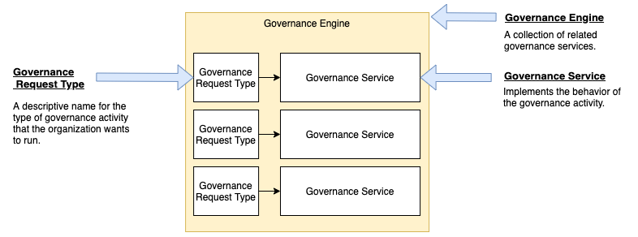

<!-- SPDX-License-Identifier: CC-BY-4.0 -->
<!-- Copyright Contributors to the ODPi Egeria project. -->

# Governance Request Type

The governance request type defines the descriptive name of a specific
governance activity that the organization wishes to run.

The request type is mapped to a [governance service](https://egeria-project.org/concepts/governance-service) implementation
along with request parameters to configure the behaviour of the service
in a [governance engine definition](https://egeria-project.org/concepts/governance-engine) as shown in
Figure 1.

> **Figure 1:** Governance request types as part of a governance engine definition

Governance services are run by the
[Open Metadata Engine Services (OMES)](../../../../engine-services)
in an [Engine Host](https://egeria-project.org/concepts/engine-host)
OMAG Server.  The [Engine Host Services](../../../../governance-servers/engine-host-services)
called the [Metadata Store Service](../..)

They are used by the [Governance Engines](https://egeria-project.org/concepts/governance-engine)
to determine which [Governance Service](https://egeria-project.org/concepts/governance-service)
to run.

## Related Information

The Open Metadata Types model 
**[0461 Governance Action Engines](https://egeria-project.org/types/4/0461-Governance-Engines)**
shows how the request type links the governance engine to the
governance service via the **SupportedGovernanceService** relationship.

----

* [Return to Metadata Store Service Concepts](.)
* [Return to Metadata Store Service Overview](../..)

----
License: [CC BY 4.0](https://creativecommons.org/licenses/by/4.0/),
Copyright Contributors to the ODPi Egeria project.