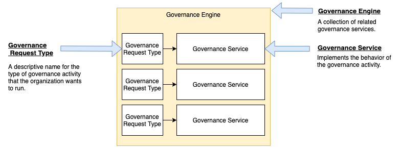

<!-- SPDX-License-Identifier: CC-BY-4.0 -->
<!-- Copyright Contributors to the ODPi Egeria project. -->

# Metadata Store Service User Guide

## Defining Governance Engines and Governance Services

> **Figure 1:** Governance request types as part of a governance engine definition

## Defining Governance Action Processes

----
Return to the [module overview](../..).

----
License: [CC BY 4.0](https://creativecommons.org/licenses/by/4.0/),
Copyright Contributors to the ODPi Egeria project.

