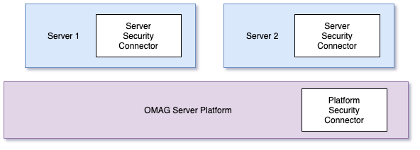
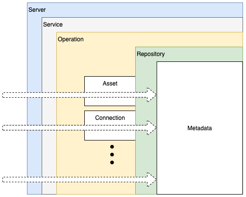

<!-- SPDX-License-Identifier: CC-BY-4.0 -->
<!-- Copyright Contributors to the ODPi Egeria project. -->


# Open Metadata Security

Open Metadata Security provides fine-grained authorization services for open metadata services, types and instances.
Since each organization will have different security requirements, the support is implemented through connectors.
Egeria defines the interfaces and when it will call the connector.  You define the behavior when the connector is called
and Egeria acts on the returned decision.

The `metadata-security` module defines the base classes and interfaces for the
open metadata security connectors as well as the server implementation to host and call them.

There are two types of connector:

* **Open metadata platform security connector** - secures access to the
platform services that are not specific to an OMAG Server.  This includes
the admin services to create new servers, the ability to start and stop new servers as well as the
ability to query whether a server is running, and if it is, what services are active.

* **Open metadata server security connector** - secures access to the specific services of an OMAG server.  This includes
the server itself, specific services within the server, specific Assets and Connections managed by the server and
the types and instances stored in the local repository.

The 2 types of connectors are shown in Figure 1:


> **Figure 1:** positioning of the security connectors

Within an OMAG Server Platform there is one instance of the 
open metadata platform security connector.  This connector is
configured once the platform is running using the admin service call:
```
POST /open-metadata/admin-services/users/{userId}/platform/security/connection
```
where the `{userId}` is the administrator's userId.
The connection for the connector and the platform URL root are passed
in the request body.  There are `GET` and `DELETE` services with the same URL
to retrieve and remove this connector respectively.

The open metadata server security connector is configured for each
OMAG server to allow for each server to have a different implementation.
The admin services command to configure a security connector for a server is:
```
POST /open-metadata/admin-services/users/{userId}/servers/{serverName}/security/connection
```
where the `{userId}` is the administrator's userId and `{serverName}` is the name of the server where the connector is to run.
The connection for the server security connector is passed
in the request body.  Again, there are `GET` and `DELETE` services with the same URL
to retrieve and remove this connector respectively.

The security implementation in a server potentially invokes the server security connector
multiple types as the request (shown as dotted white arrow) penetrates the server code.
Figure 2 shows the different layers of checks.  Each layer is optional and so the
server security connector can be implemented to support the most appropriate
granularity of security for the situation. Details of the implementation choices are
given in the [security connector API](metadata-security-apis).


> **Figure 2:** layers of security checks within the server

The security connectors are optional.  If they are not defined then there are no additional authorization checks
performed inside the OMAG Server Platform nor the OMAG Servers hosted on the platform.
As such, it is important that the open metadata platform security connector is configured
as soon as the platform is started, and the server security connector is configured before the server is started for the first time.

The `metadata-security` module provides the interfaces, connector implementation and plug points that sit in the
server and server platform.  Details of the specifics of these interfaces follow. 

* [Open Metadata Security Connector Interfaces](metadata-security-connectors)
* [Open Metadata Security server-side implementations](metadata-security-server)
 
There are sample
implementations of these connectors for [Coco Pharmaceuticals](https://opengovernance.odpi.org/coco-pharmaceuticals/)
in the samples module under [open-metadata-security-samples](../../../open-metadata-resources/open-metadata-samples/open-metadata-security-samples)


----
* Return to [Common Services](..)
* Find out more about setting up security in the [Administration Guide](../../admin-services/docs/user/)
    * [Configuring the Platform Security Connector](../../admin-services/docs/user/configuring-the-platform-security-connector.md)
    * [Configuring the Server Security Connector](../../admin-services/docs/user/configuring-the-server-security-connector.md)
    

----
License: [CC BY 4.0](https://creativecommons.org/licenses/by/4.0/),
Copyright Contributors to the ODPi Egeria project.