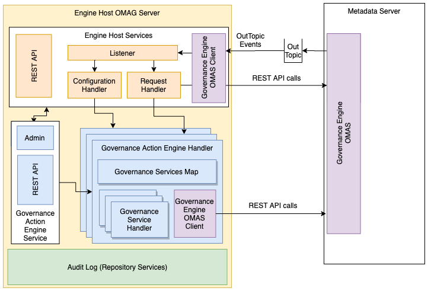

<!-- SPDX-License-Identifier: CC-BY-4.0 -->
<!-- Copyright Contributors to the ODPi Egeria project. -->

# Governance Action Engine Services - server side

The **governance-action-server** module contains the server-side
implementation of the engine services that hosts one or more
[governance action engines](../../../frameworks/governance-action-framework/docs/governance-action-engine.md).

It is shown in figure 1:

> **Figure 1:** Structure of the governance action engine services running in an engine host

----
* Return to [module overview](..)

----
License: [CC BY 4.0](https://creativecommons.org/licenses/by/4.0/),
Copyright Contributors to the ODPi Egeria project.