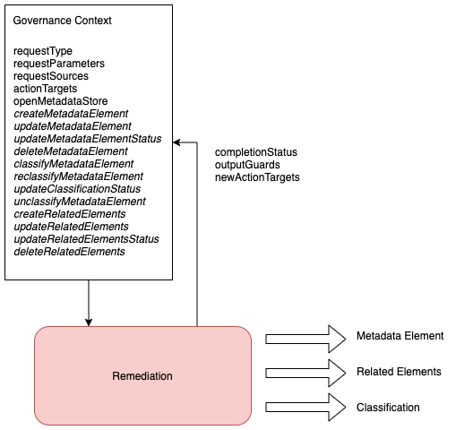

<!-- SPDX-License-Identifier: CC-BY-4.0 -->
<!-- Copyright Contributors to the ODPi Egeria project. -->

# Remediation Governance Service

Performs updates to metadata.
Examples of remediation services are duplicate linking and consolidating.

> **Figure 1:** Governance context for the remediation governance service

----
* Return the [Governance Action Framework Overview](..)

----
License: [CC BY 4.0](https://creativecommons.org/licenses/by/4.0/),
Copyright Contributors to the ODPi Egeria project.