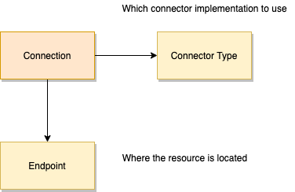

<!-- SPDX-License-Identifier: CC-BY-4.0 -->
<!-- Copyright Contributors to the ODPi Egeria project. -->

# Connector Type - part of the [Open Connector Framework (OCF)](../..)

The connector type is a set of properties that defines the 
supported capabilities and the identity of the [connector provider](connector-provider.md)
for a [connector](connector.md).  Its properties are:

 * **guid** - Globally unique identifier for the connector type.
 * **url** - External link address for the connector type properties in the metadata repository.  
 * **qualifiedName** - The official (unique) name for the connector type. This is often defined by the IT
    systems management organization and should be used (when available) on audit logs and error messages.
 * **displayName** - A consumable name for the connector type.   Often a shortened form of the qualifiedName for use
  on user interfaces and messages.  The displayName should be only be used for audit logs and error messages
  if the qualifiedName is not set.
 * **description** - A full description of the connector type covering details of the assets it connects to
   along with usage and versioning information.
 * **connectorProviderClassName** - The connector provider is the factory for a particular type of connector.
 This property defines the class name for the connector provider that the Connector Broker should use to request
 new connector instances.
 * **recognizedAdditionalProperties** - these are the Connection additional properties recognized by the connector implementation
 * **recognizedConfigurationProperties** - these are the Connection configuration properties recognized by the connector implementation
 * **recognizedSecuredProperties** - these are the Connection secured properties recognized by the connector implementation
 * **additionalProperties** - Any additional properties that the connector provider needs to know in order to
  create connector instances.  

The connector type is linked to the
[Connection](connection.md) objects that request this type of connector.

> **Figure 1:** Connection structure

## Further information

 * The open metadata type for a connector type is defined in 
   [model 0201](../../../../../open-metadata-publication/website/open-metadata-types/0201-Connectors-and-Connections.md).

 * The [open connector archives](../../../../../open-metadata-resources/open-metadata-archives/open-connector-archives) 
   module provides an open metadata archive that contains connector types for connectors supported by Egeria.

----
* [Return to OCF Overview](../..)

----
License: [CC BY 4.0](https://creativecommons.org/licenses/by/4.0/),
Copyright Contributors to the ODPi Egeria project.