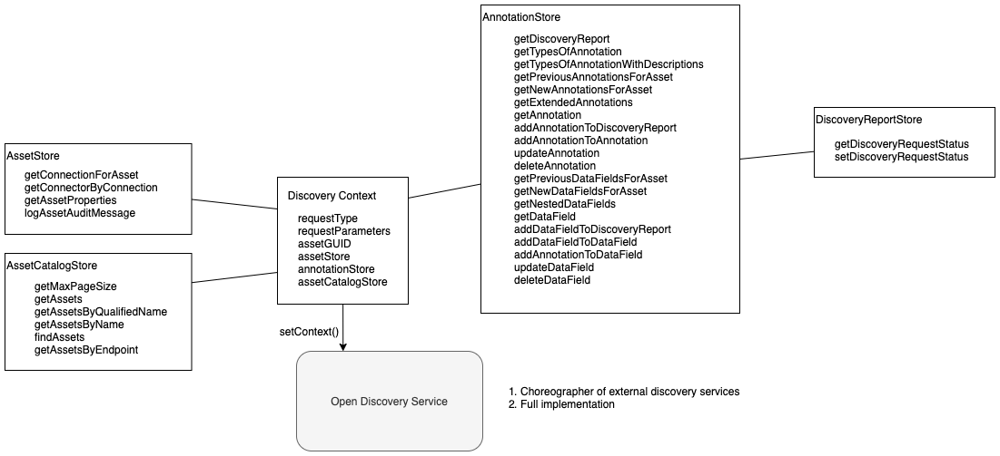

<!-- SPDX-License-Identifier: CC-BY-4.0 -->
<!-- Copyright Contributors to the ODPi Egeria project. -->

# Discovery Context

provides the discovery service with access to information about
the discovery request along with the open metadata repository interfaces.

The discovery context provides parameters used by
a [discovery service](discovery-service.md) to locate
and analyze an asset and then record the results.

----
License: [CC BY 4.0](https://creativecommons.org/licenses/by/4.0/),
Copyright Contributors to the ODPi Egeria project.